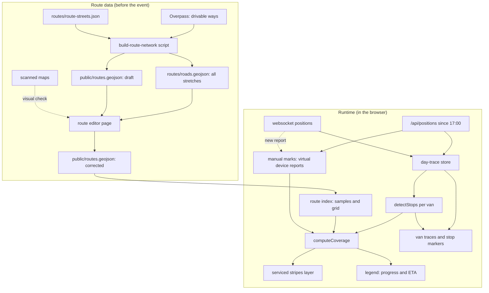

# Planned Routes with Stop-Based Progress and ETA - Plan

## Goal Capsule

- **Objective:** Show the 7 loppemarked pickup routes on the kart.koredu.no main map. Show which stretches the vans have serviced, a progress bar per route, and an ETA once a route passes 20%.
- **Authority:** Product Contract R-IDs win on behavior. Planning Contract KTDs win on mechanism. Units never override either.
- **Stop conditions:**
  - Stop and hand over to the user when U2 reaches the manual correction step. The corrected route file is a user deliverable.
  - Stop and ask if the April replay in U4 shows far lower progress than the evening's real result, and tuning the constants does not close the gap.
  - Stop and ask if the spike in U9 shows that mark reports do not reach every viewer.
- **Execution profile:** Frontend change in this fork, one Node script, and one dev-only editor page. The Traccar server code and database schema do not change.

---

## Product Contract

### Summary

The map shows each planned route as a wide, pale band in its own color. A stretch counts as serviced only where a van made a pickup stop, and it is then drawn in the color of the van that serviced it. A legend lists each route with a progress bar, a percentage, and an ETA. Route geometry is drafted from OpenStreetMap and corrected in a click-to-toggle editor. Users can also mark stretches as serviced by hand.

### Problem Frame

The route maps exist only as scanned paper maps with highlighter marks (`routes/Rute N *.pdf`). The coordinator cannot see on the live map where each van should go or how far each route has come.

Driving past a house is not the same as servicing it. A full van drives past pickup spots on its way back to the base at Tåsen skole to unload. A van that starts at the far end of its route drives past the near end first. Late in the evening, vans are sent to help on other routes. The van traces alone therefore say little about which stretches are done.

### Requirements

**Route display**

- R1. The main map shows the 7 planned routes. Each route has its own color.
- R2. Planned routes are wide, pale bands drawn below the van traces. Van traces stay thin solid lines.
- R3. The map layer switcher can hide the planned routes and the serviced stripes.

**Vans and colors**

- R4. A van's main route is the device attribute `route` (`1`–`7`). It sets the van's color and nothing else.
- R5. A van's color is its `web.reportColor` attribute when set, then the color of its main route, then the existing fallback palette. The van's trace, stop markers, serviced stripes and legend segments all use this color.

**Serviced stretches**

- R6. A stretch of a route counts as serviced only where a van made a pickup stop. Driving past without stopping never counts.
- R7. A pickup stop is a dwell of at least the minimum stop time. Stops near the base do not count.
- R23. A traffic stop does not count. A stop is a traffic stop when it is at an intersection or a traffic light, the same van made no other stop nearby, and it was short.
- R8. A pickup stop services the part of the route that the van drove shortly before and after the stop. Two stops close together also service the route between them.
- R9. Stops by any van count for the route they are on. The van's main route does not matter.
- R10. A serviced stretch is drawn in the color of the van that serviced it. Where several vans serviced the same stretch, each van's color shows as its own stripe, side by side.

**Progress and ETA**

- R11. The legend lists each route with its color swatch, name, progress bar, and percentage.
- R12. Route progress is the serviced length divided by the total route length. A stretch serviced by several vans counts once.
- R13. The progress bar is split by van color. Manually marked stretches use a neutral color.
- R14. The legend shows an ETA (HH:mm, Europe/Oslo) only when progress is above 20% and below 100%. At 100% it shows done.
- R15. Progress covers the time from 17:00 Europe/Oslo on the event day and updates live.
- R22. Before 17:00 the map shows where the vans are. Positions from before 17:00 never count toward traces, stops, progress or ETA.

**Manual marks**

- R16. A user can mark one stretch, or a whole street within a route, as serviced by hand, and can undo the mark.
- R17. Marking works only in a marking mode that is off by default, so a stray tap on the map does nothing.
- R18. Manual marks are shared. Every viewer sees a mark within seconds, and marks survive a page reload.
- R21. A user can mark the rest of a route as serviced in one action, and can undo it. The route then shows 100% and done.

**Route geometry**

- R19. Route geometry is drafted automatically from OpenStreetMap and checked against the scanned maps.
- R20. The user can correct the geometry by hand in an editor: add stretches to a route, remove them, and export the result.

### Acceptance Examples

- AE1. **Covers R6.** Given a van drives the full length of a route street without stopping, when coverage is computed, then no part of that street is serviced.
- AE2. **Covers R8.** Given a van stops for 60 s at two houses 150 m apart on the same street, when coverage is computed, then the street between the stops is serviced, and so is the service reach before the first stop and after the second.
- AE3. **Covers R9, R10.** Given a van with main route 5 makes pickup stops on route 2, when the map renders, then route 2's progress rises and the serviced stripe has the van's color.
- AE4. **Covers R10, R12.** Given two vans serviced the same stretch, when the map renders, then the stretch shows two stripes, and the stretch counts once in the progress.
- AE5. **Covers R7.** Given a van stands at the base for 15 minutes to unload, when coverage is computed, then nothing is serviced.
- AE6. **Covers R14.** Given the first stop on route 3 was at 18:00 and progress is 25% at 18:30, when the legend renders, then it shows the ETA 20:00.
- AE7. **Covers R14.** Given route 5 is 15% done, when the legend renders, then it shows the bar and "15%" with no ETA.
- AE11. **Covers R23.** Given a van on its way to the base waits 70 s at an intersection on a route street and makes no other stop within 300 m, when coverage is computed, then the wait services nothing.
- AE12. **Covers R23.** Given a van stops 70 s at a corner house and stops again 80 m further on, when coverage is computed, then both stops count.
- AE10. **Covers R22.** Given a van stops for 2 minutes on a route street at 16:50, when the clock passes 17:00, then that stop services nothing, and the van's trace starts at its first position after 17:00.
- AE9. **Covers R21.** Given route 4 is at 85% and the crew reports it done, when a user marks the rest of route 4 as serviced, then the legend shows 100% and done for route 4, and an undo returns it to 85%.
- AE8. **Covers R16, R18.** Given a user marks a street as serviced, when a second browser has the map open, then it shows the mark within seconds, and an undo removes it in both.

### Scope Boundaries

- The plan does not cover route optimization, driving order, or navigation for drivers.
- Routes are not edited in the production app. A route changes by editing in the editor page and redeploying `public/routes.geojson`.
- The plan does not change the Traccar server code or the database schema.
- The ETA is a straight-line estimate. Unload trips make it swing; this is accepted.

### Deferred to Follow-Up Work

- Showing in the legend which vans are active on a route right now.
- Showing that a van is offline or has stale positions in the legend.
- An ETA based on the recent service rate instead of the average rate.

---

## Planning Contract

### Key Technical Decisions

- KTD1. **Route geometry is an OpenStreetMap draft, checked against the scanned maps, then corrected by hand.** (session-settled: user-approved — chosen over drawing every route by hand and over fully automatic tracing: most of the work is automated, but partial streets and unnamed stubs need a human check.) A script selects streets by name per route. The implementer then compares each draft with its scanned map and fixes the differences in the editor before the user reviews it.
- KTD2. **Hand correction uses a click-to-toggle editor page.** (session-settled: user-approved — chosen over geojson.io: clicking stretches is faster than drawing lines, and the stretches line up with intersections.) The page is dev-only. It is served by the Vite dev server and is not part of the production build.
- KTD3. **The unit of route geometry is the stretch.** A stretch is a piece of an OSM way between two intersections, split further so no stretch is longer than `STRETCH_MAX_M`. Each stretch has a stable id, a street name, and a route number. `public/routes.geojson` holds one `LineString` feature per stretch. A street shared by two routes has one stretch feature per route.
- KTD4. **A pickup stop is detected from dwell time, not from reported speed alone.**
  - Two consecutive positions form a slow segment when their distance divided by their time difference is below `STOP_MAX_SPEED`, and their distance is at most `STOP_SEG_MAX_M`. The distance limit keeps a long reporting gap from looking like a stop.
  - Adjacent slow segments merge into one stop. A van that crawls at walking pace while the crew collects is therefore one long stop.
  - The stop counts when it lasts between `STOP_MIN_S` and `STOP_MAX_S`. A longer dwell is a break, not a pickup.
  - A segment with a time difference of zero or less is skipped.
  - A stop counts only when it begins inside the window. A dwell that is under way at the first position of a trace does not count.
  - Stops within `BASE_RADIUS_M` of the base are dropped.
- KTD17. **A traffic stop is recognized by place, isolation and duration.** (session-settled: user-approved — chosen over also dropping short isolated stops in the middle of a block, and over the minimum stop time alone: it would have dropped 8 of 317 stops in April, and a pickup at a corner house still counts when the van also stopped nearby.)
  - A stop is a traffic stop when all three hold: it lies within `INTERSECTION_RADIUS_M` of an intersection or within `SIGNAL_RADIUS_M` of a traffic light, the same van made no other stop within `LINK_MAX_M` of driving distance before or after it, and it lasted less than `TRAFFIC_MAX_S`.
  - The location of a stop is the position of its longest single dwell.
  - An intersection is a node shared by two or more drivable ways that are not service ways. Driveways do not make intersections.
  - `public/routes.geojson` carries the intersections and traffic lights of the area as `Point` features with a `kind` property. The build script writes them, and the editor keeps them on export.
- KTD5. **A stop services the path the van drove around it.** (session-settled: user-approved — chosen over marking the whole block and over a circle around the stop: a parallel street the van never drove stays unmarked.) The serviced path runs from `SERVICE_REACH_M` of driving distance before the stop to `SERVICE_REACH_M` after it. When the next stop by the same van is within `LINK_MAX_M` of driving distance, the path between the two stops is serviced too. Route samples within `COVER_RADIUS_M` of the serviced path are serviced by that van.
- KTD6. **Attribution is geometric.** Every van's stops are tested against every route. A sample that belongs to two routes is serviced for both. The virtual device of KTD12 is not a van: its positions never count as stops.
- KTD7. **Coverage is recomputed in full from its inputs.** The inputs are the route index, the day's traces per van, and the manual marks. There is no incremental state. The recompute is throttled to once every few seconds. The data is small: about 3,000 samples and at most a few thousand positions per van.
- KTD8. **One day-trace store serves both the traces and the coverage.**
  - It loads the positions of the window for every van, then appends websocket positions once a van's history has loaded. It skips the virtual device.
  - It reloads from the last seen `fixTime` when the socket reconnects or the tab becomes visible again, because the socket controller only refetches the latest position.
  - It inserts positions in `fixTime` order and drops a position whose id it already holds. A reload can otherwise put older positions behind newer ones.
  - It thins each trace: it keeps a position when it is at least `THIN_STEP_M` from the last kept position, and it always keeps the latest position. In April this cut a trace from about 14,000 to about 3,000 positions without losing the dwell times.
  - `MapRouteTraces` reads from this store instead of fetching on its own.
- KTD9. **Stop markers on the map use the same detection as coverage.** The existing stop dots switch from "speed ≤ 1 kn" points to the stops of KTD4, so what the coordinator sees as a stop is what counts.
- KTD10. **Several vans on one stretch render as parallel stripes.** Each run of serviced samples becomes one line feature per van, with a data-driven `line-offset` and a width that divides the band between the vans. Each run is oriented the same way before the offset is applied, so a van's stripe keeps its side where two OSM ways with opposite directions meet. The pale band stays visible under unserviced parts. In the progress bar (R13), a sample serviced by several vans belongs to the van that serviced it first.
- KTD11. **The ETA is a linear extrapolation from the first service on the route.** `eta = start + (now − start) / progress`, where `start` is the time of the first pickup stop or manual mark on that route.
- KTD12. **Manual marks are reports from a virtual device.** (session-settled: user-approved — chosen over a Traccar device setting and over browser-only storage: every viewer sees a mark within seconds, and two users marking at once cannot overwrite each other.)
  - The virtual device is a Traccar device with the attribute `manualMarks` set to true. The client finds it in the device store.
  - A mark is an OsmAnd position report for the virtual device. The `id` parameter is the device's `uniqueId`. Extra parameters carry the stretch ids and an on/off flag. The server stores them as position attributes.
  - A report can carry a route number instead of stretch ids. It closes the route: every sample of the route that no van serviced counts as manually serviced. An off report for the route opens it again.
  - The report carries no time. The server then stamps it on receipt, so the order of the marks does not depend on any browser's clock.
  - The report is a form-encoded POST to the server's web origin, as `src/other/EmulatorPage.jsx` does on https. If U9 shows that the web origin does not accept reports, the report goes to the intake address `https://inntak.koredu.no/`.
  - When the target is the page's own origin, the response status tells success or failure. In every other case the request runs in `no-cors` mode, and the websocket echo with the same stretch ids and flag confirms it. The dev server is such a case.
  - The marks of the window are the virtual device's positions, loaded with their attributes and ordered by position id. The last report per stretch wins. A report with an unknown stretch id or a value of the wrong type is ignored.
  - The virtual device stays out of the day-trace store, the stops, the device list, the markers and the traces.
  - Marking is off when the window ends in the past.
  - U9 result (2026-09-28): both transports pass. Reports to the web origin `https://kart.koredu.no/` and to the intake `https://inntak.koredu.no/` were stored in order with the server's time, `on` as a boolean and the stretch ids as a string, and a second websocket connection received each report within seconds. Two reports from the same coordinates were both kept. The app uses the web origin on https (`MARK_TARGET = 'origin'`) and the intake from the dev server.
- KTD13. **Route colors and tuning constants live in one module.** `src/map/main/plannedRoutes.js` holds `ROUTE_COLORS`, the fallback palette, the constants of the table below, the base location, the server origin, and the intake address.
- KTD14. **The legend is a React panel inside a MapLibre custom control.** The control creates a container element, and the panel renders into it with `createPortal`, so it keeps the theme and store context. It can be collapsed. Labels are hard-coded in Norwegian.
- KTD15. **One time window governs traces, stops, coverage and marks.**
  - The window starts at 17:00 Europe/Oslo and has no end. Between midnight and 04:00 it still starts at 17:00 the day before, so an event that runs past midnight keeps its traces. Between 04:00 and 17:00 the window has not started, and nothing counts.
  - The store accepts a position only when its `fixTime` lies inside the window. This also holds for websocket positions. Position markers do not depend on the window.
  - The URL parameters `from` and `to` override the window, which makes the feature testable before the event.
  - When `to` is set, the ETA uses `to` as `now`. With the April event's window, the app shows that evening's result.
- KTD16. **Tests run with `node --test` on pure modules.** `plannedRoutes.js`, `routeCoverage.js` and `manualMarks.js` import each other with explicit `.js` extensions, import no app module, and read `window` only inside functions. Tests use synthetic traces only; no real GPS data is committed.

- KTD18. **Slow driving also counts as service.** (session-settled: user-directed, 2026-09-28 — chosen over stops alone after the April replay: with stops only, the routes whose vans reported often ended at 80–94%, although all routes were finished, and over 90% of the missing parts of routes 3 and 4 had been driven by a van.) A trace segment of at most `SLOW_SEG_MAX_M` driven slower than `SLOW_DRIVE_SPEED`, outside the base radius, services the route samples within `COVER_RADIUS_M`. This relaxes R6: a van that crawls past without picking up also counts.

### Tuning Constants

The start values come from an analysis of the April event (2026-04-10). U4 checks them on the map against the routes and against what the user remembers of the evening.

| Constant | Start value | Meaning |
|---|---|---|
| `STOP_MAX_SPEED` | 1.5 m/s | Average speed below which a trace segment is slow |
| `STOP_SEG_MAX_M` | 60 m | Maximum distance between two positions of a slow segment |
| `STOP_MIN_S` | 40 s | Minimum dwell for a pickup stop |
| `STOP_MAX_S` | 1,200 s | Maximum dwell for a pickup stop |
| `INTERSECTION_RADIUS_M` | 25 m | Distance to an intersection within which an isolated stop can be a traffic stop |
| `SIGNAL_RADIUS_M` | 40 m | The same for a traffic light |
| `TRAFFIC_MAX_S` | 120 s | An isolated stop at an intersection counts when it lasts at least this long |
| `SERVICE_REACH_M` | 75 m | Driving distance serviced before and after a stop |
| `LINK_MAX_M` | 300 m | Maximum driving distance between two stops that service the path between them |
| `COVER_RADIUS_M` | 20 m | Maximum distance from the serviced path to a route sample |
| `SAMPLE_STEP_M` | 10 m | Distance between route samples |
| `STRETCH_MAX_M` | 100 m | Maximum stretch length |
| `BASE` | 59.9535, 10.7510 | The base at Tåsen skole, from the long dwells in April |
| `BASE_RADIUS_M` | 150 m | Radius around the base where stops do not count |
| `THIN_STEP_M` | 5 m | Minimum distance between kept positions in the trace store |
| `MAX_GAP_M` | 500 m | Trace segments longer than this are ignored |

### High-Level Technical Design



The coverage rule as a sketch:

```text
for each van:
  stops = detectStops(trace), without stops near the base and without traffic stops
  for each stop:
    path = the trace from REACH before the stop to REACH after it
    if the next stop is within LINK_MAX of driving distance:
      extend path to the next stop
    mark route samples within COVER_RADIUS of path: serviced by van at stop time
for each manual mark, last report per stretch wins:
  if on: mark all samples of the stretch: serviced by "manual" at report time
for each closed route, last report per route wins:
  mark every unserviced sample of the route: serviced by "manual" at report time
progress(route) = serviced samples / all samples
```

Layer order from bottom to top: planned bands, serviced stripes, van traces, stop markers, position markers.

### Assumptions

- The phones report about once per second, as 7 of the 9 vans did in April. Stops are clear at that rate. Stop detection does not work for a phone that reports as rarely as Bil 6 and Bil 7 did in April.
- Every logged-in user may make manual marks, including the read-only account.
- OSM street names match the names on the scanned maps in most cases.
- The Traccar server accepts reports from the virtual device and pushes them to every viewer. U9 verifies this before anything is built on it.
- Every user who should see manual marks has access to the virtual device.

### Risks

| Risk | Mitigation |
|---|---|
| A phone reports too rarely, and its van's stops cannot be detected. This happened to 2 of 9 vans in April. | The pre-event checklist covers the phone settings. The coordinator marks that van's stretches by hand. |
| The day's history is large at the end of the evening: about 71,000 positions in April, several tens of MB. A reload on a phone is slow. | Accepted. The existing traces already load the same data. The store loads each device once and thins the traces in memory. |
| A van waits for a long time on a route street, for example in a queue near the base. | `STOP_MAX_S` drops dwells longer than 20 minutes. |
| A traffic wait counts as a pickup stop. | KTD17 drops isolated short stops at intersections and traffic lights. A short isolated wait in the middle of a block still counts; in April there were 8 such stops among 317, and they cannot be told from a single small pickup. One false stop services up to 150 m. |
| A van waits on an approach street just outside the base radius on every unload trip. | U4 checks the stops around the base. `BASE_RADIUS_M` is tunable. |
| A street with no pickups has no stops and stays unserviced, so a route never reaches 100% and keeps showing an ETA. | Two stops close together service the path between them (KTD5). The coordinator marks the rest by hand, or closes the route in one action (R21). |
| The intake address has no login. Anyone who knows the virtual device's id can send marks. | Accepted by the user. Every mark can be undone. The id is a long random value, and it is only visible to logged-in users with access to the device. |
| The server's position filter drops a mark, or the server does not push it to viewers. | U9 sends two reports from the same place before anything is built. The April data shows that the distance and static filters are off: the server stored positions one second and a few meters apart. |
| Someone who holds the virtual device's identifier sends a report dated in the future. The server then stops pushing later marks to viewers until that time has passed. | Accepted by the user; it takes a deliberate act. Recovery: create a new virtual device, remove the `manualMarks` attribute from the old one, and reload the open browsers. |
| After 17:00, a stop by a passing van on another route sets that route's ETA start early. | Accepted. The ETA shows only above 20% progress, which limits the effect. |
| `useMapLayer` re-adds layers when its deps change, which moves them above the traces. | Keep `layersDeps` static for the band and stripe layers. Check the order in the smoke test. |

---

## Implementation Units

### Phase A: Route data

### U1. Road network and route draft from OpenStreetMap

**Goal:** Produce the stretch network for the area and a first draft of the 7 routes.

**Requirements:** R19, R23. KTD1, KTD3, KTD17.

**Dependencies:** None.

**Files:**
- Create `routes/route-streets.json`: per route, the number, a bounding box, and the highlighted street names.
- Create `scripts/build-route-network.mjs`.
- Create `routes/roads.geojson`: every drivable stretch in the area.
- Create `public/routes.geojson`: the draft.
- Create `routes/rute-1.png` … `routes/rute-7.png`: the scanned maps as images.
- Modify `eslint.config.js`: add `scripts/**` to the ignores, next to `vite.config.js`. The script uses Node globals.

**Approach:**
1. Convert each scanned map to PNG with `sips`. Read the highlighted street names from each map into `routes/route-streets.json`.
2. Pick each route's bounding box by hand on a web map, with a margin. The scans have no coordinates.
3. The script fetches the ways inside the union of the boxes from Overpass. It keeps the drivable classes (`residential`, `living_street`, `unclassified`, `tertiary`, `secondary`, `primary`, `service`, and link variants) and drops footways, cycleways, paths and steps.
4. The script splits the ways at nodes shared by two or more ways, then at `STRETCH_MAX_M`. Each stretch gets the id `<way id>-<index>`.
5. The script assigns a stretch to a route when its street name is on the route's list and it lies inside the route's box.
6. The script writes the intersections and traffic lights of the area as `Point` features (KTD17).
7. The script logs the street names with no match and the number of stretches per street.
8. The script sends a `User-Agent` header. The Overpass server answers 406 without one.

**Test expectation:** none — a one-off data script. U2 checks its output visually.

**Verification:** `routes/roads.geojson` covers all 7 route areas. The draft holds stretches for all 7 routes. Unmatched names are listed.

### U2. Route editor and corrected routes

**Goal:** Give the user a fast way to correct the routes, and produce the final `public/routes.geojson`.

**Requirements:** R19, R20. KTD1, KTD2, KTD3.

**Dependencies:** U1.

**Files:**
- Create `route-editor.html` and `tools/route-editor.js`.
- Modify `public/routes.geojson`.

**Approach:**
1. The page shows an OSM raster basemap, all stretches from `routes/roads.geojson` as thin grey lines, and the stretches of each route in the route's color.
2. The number keys `1`–`7` choose the current route. A click on a stretch adds it to the current route or removes it.
3. The scanned map of the current route shows beside the map.
4. An export button downloads the result as `routes.geojson`, with the `Point` features of KTD17 unchanged. The page warns before unload when there are unsaved changes.
5. The implementer compares each draft route with its scanned map and corrects the differences. Partial streets and unnamed side stubs are the expected differences.
6. The user reviews all 7 routes in the editor and exports the final file.

**Execution note:** Step 6 is a user step. Hand over with the editor running, and wait for the corrected file.

**Patterns to follow:** The MapLibre worker setup in `src/map/core/MapView.jsx`. The editor page needs the same worker URL.

**Test expectation:** none — a dev-only tool. It is verified by use.

**Verification:** The user confirms that all 7 routes match the scanned maps. `npm run build` output does not contain the editor page.

### Phase B: Transport check and coverage engine

### U9. Mark transport spike

**Goal:** Prove that a mark report reaches every viewer, before anything is built on it.

**Requirements:** R18. KTD12.

**Dependencies:** None.

**Files:** None. The spike leaves no code in the repo. Its result is recorded in KTD12.

**Approach:**
1. Ask the user to create the virtual device, as described in Operational Notes.
2. From a logged-in browser on https://kart.koredu.no, send an on report for one made-up stretch id to the page's own origin, in the way `handleClick` in `src/other/EmulatorPage.jsx` does. Send no time.
3. A few seconds later, send an off report from the same coordinates.
4. The spike passes when both reports arrive over the websocket in a second browser, and both come back from `/api/positions` in order, with the stretch id and the flag intact and with the server's time.
5. If the web origin does not accept the reports, repeat steps 2 to 4 against the intake address of KTD12.
6. Repeat the on and off reports from a page on the dev server, in `no-cors` mode, and check the websocket echo.
7. Record in KTD12 which transport works.

**Execution note:** This is a spike against the live server. It needs the server running and the user's login.

**Test expectation:** none — the spike produces a decision, not code.

**Verification:** KTD12 names the transport that passed. If no transport passed, the work stops per the Goal Capsule.

### U3. Stop detection and coverage math

**Goal:** Pure functions that turn route geometry, van traces and manual marks into serviced samples, progress and ETA.

**Requirements:** R6, R7, R8, R9, R12, R13, R14, R21, R22, R23. KTD4, KTD5, KTD6, KTD7, KTD10, KTD11, KTD16, KTD17.

**Dependencies:** None. Tests use synthetic routes.

**Files:**
- Create `src/map/main/plannedRoutes.js`.
- Create `src/map/main/routeCoverage.js`.
- Create `src/map/main/routeCoverage.test.js`.

**Approach:**
1. `buildRouteIndex` samples every stretch at `SAMPLE_STEP_M` and puts the samples in a grid. It puts the intersections and traffic lights in a second grid. A lookup expands the search box by `COVER_RADIUS_M`, so samples in a neighboring cell are found.
2. `detectStops` returns the stops of one trace, with start time, end time and location. It drops the traffic stops of KTD17.
3. `computeCoverage` returns, per sample, the vans that serviced it and the first service time.
4. `routeStatus` returns the progress, the share per van, the manual share, and the ETA. The shares follow the first-servicer rule of KTD10.
5. `servicedFeatures` turns runs of serviced samples into line features with color, offset and width per van (KTD10).
6. Distances use the equirectangular approximation. No new dependency.

**Execution note:** Implement test-first. The rules of KTD4 and KTD5 are the product; the tests pin them down.

**Test scenarios:**
- Covers AE1. A trace along a whole street with no dwell services nothing.
- Covers AE2. Two 60 s stops 150 m apart service the path between them and the service reach beyond each.
- Two stops 600 m apart service the reach around each stop, and the path between them stays unserviced.
- Covers AE3. A stop by a van with main route 5 on a route 2 stretch services route 2.
- Covers AE4. Two vans that service the same stretch give two entries per sample, and the progress counts the stretch once.
- Covers AE5. A 15-minute dwell inside the base radius gives no stop.
- A 20 s dwell gives no stop. A 45 s dwell gives a stop.
- A 25-minute dwell on a route street gives no stop.
- Two positions 400 m apart and 20 minutes apart give no stop.
- A van that crawls 80 m in 3 minutes gives one stop that spans the 80 m.
- Sparse reporting: two positions 60 m apart and 90 s apart give one stop.
- Dense reporting: ten positions with speed 0 over 60 s give one stop, not ten.
- A trace with one position out of order gives the same stops as the ordered trace.
- A repeated position inside a dwell gives one stop, not two.
- Covers AE11. An isolated 70 s stop 10 m from an intersection gives no stop.
- Covers AE12. A 70 s stop 10 m from an intersection with another stop 80 m further on gives two stops.
- An isolated 150 s stop 10 m from an intersection gives a stop.
- An isolated 70 s stop 60 m from the nearest intersection gives a stop.
- An isolated 70 s stop 35 m from a traffic light gives no stop.
- A traffic stop does not link: two pickup stops 250 m apart with a traffic stop between them are linked to each other.
- Covers AE10. A trace that begins inside a dwell gives no stop for that dwell. The next dwell gives a stop.
- A stop on a street 40 m parallel to the route services nothing.
- A stop 15 m from a route sample that lies across a grid cell border services the sample.
- A trace segment longer than `MAX_GAP_M` next to a stop is not part of the serviced path.
- A sample shared by two routes is serviced for both.
- A manual mark services every sample of its stretch. A later off report for the same stretch removes it.
- Covers AE9. A closed route has progress 1. The samples that vans serviced keep their vans, and the rest is manual.
- A closed route that is opened again returns to its earlier progress.
- Covers AE6. First service at 18:00, progress 0.25, now 18:30 gives the ETA 20:00.
- Covers AE7. Progress 0.15 gives no ETA. Progress 1 gives no ETA.
- A route with no stops and no marks gives progress 0 and no ETA.
- The shares per van and the manual share add up to the progress.
- A sample serviced by van A at 18:00 and by van B at 19:00 counts in van A's share.

**Verification:** `node --test src/map/main/routeCoverage.test.js` passes.

### Phase C: App integration

### U5. Day-trace store and van colors

**Goal:** One store with the day's positions for every device, and one color rule for every van.

**Requirements:** R4, R5, R15, R22. KTD8, KTD9, KTD13, KTD15.

**Dependencies:** U3.

**Files:**
- Create `src/map/main/useDayTraces.js`.
- Modify `src/map/main/plannedRoutes.js`.
- Modify `src/map/main/MapRouteTraces.js`.
- Modify `src/main/MainMap.jsx`.
- Create `src/map/main/plannedRoutes.test.js`.

**Approach:**
1. Move the 17:00 Europe/Oslo computation from `MapRouteTraces` into `trackingWindow()` in `plannedRoutes.js`. Add the `from` and `to` override of KTD15.
2. Move the fallback palette from `MapRouteTraces` into `plannedRoutes.js` (KTD16).
3. `isVan(device)` is false for a device with the `manualMarks` attribute.
4. `useDayTraces` keeps positions per van with id, longitude, latitude, speed and fix time. It follows KTD8.
5. `MainMap` calls `useDayTraces` and passes the traces to `MapRouteTraces` and to the planned-routes component. The store then survives a map style switch.
6. `MapRouteTraces` keeps its `mapRouteTraces` preference and device filter for display. It takes the color from `vanColor(device)` (R5) and the stop markers from `detectStops` (KTD9).
7. `mainRouteOf(device)` parses the `route` attribute. Values outside 1–7 give no main route.

**Patterns to follow:** The fetch loop and the duplicate-point check in `src/map/main/MapRouteTraces.js`.

**Test scenarios:**
- `mainRouteOf` returns 3 for the attribute values `'3'` and `3`.
- `mainRouteOf` returns no route for a missing attribute, `0`, `8` and `'abc'`.
- `vanColor` returns `web.reportColor` when set, even when `route` is set too.
- `vanColor` returns the route color when only `route` is set.
- `vanColor` returns a palette color when neither is set.
- `isVan` is false for a device with `manualMarks` set, and true for a device without it.
- `trackingWindow` without parameters starts at 17:00 Europe/Oslo on the given day, in summer time and in winter time.
- `trackingWindow` with `from` and `to` returns those times.
- `trackingWindow` at 16:30 has not started. At 17:00 it starts at 17:00 the same day.
- `trackingWindow` at 01:30 starts at 17:00 the day before. At 04:30 it has not started.
- Covers AE10. Integration (manual): before 17:00, a van shows as a marker, and it has no trace and no stop dots.
- Integration (manual): with the April window, no trace has a jump line to the phone's latest position.
- Integration (manual): a websocket position that arrives before the history has loaded does not create a jump in the trace.
- Integration (manual): after the tab was hidden for some minutes, the trace has no gap.

**Verification:** Traces look as before, except for the color rule and the stop markers. Each device's history is fetched once, not twice.

### U6. Planned bands and serviced stripes

**Goal:** Draw the planned routes and the serviced stretches.

**Requirements:** R1, R2, R3, R10. KTD7, KTD10.

**Dependencies:** U2, U3, U5.

**Files:**
- Create `src/map/main/MapPlannedRoutes.jsx`.
- Modify `src/main/MainMap.jsx`.

**Approach:**
1. Fetch `/routes.geojson` and build the route index once.
2. The band layer is a `line` layer with the color from a `match` on `route`, a width of about 12 and an opacity of about 0.3.
3. The stripe layer takes the features of `servicedFeatures`. Manual-only runs use a neutral color.
4. Both layers carry `traccar:title` metadata with the title `Planlagte ruter`, so one switcher entry toggles both.
5. Recompute the coverage when the traces or the marks change, throttled per KTD7.
6. Mount the component in `MainMap` before `MapLiveRoutes` and `MapRouteTraces`.

**Patterns to follow:** `src/map/main/PoiMap.js` for fetching and `useMapLayer`.

**Test expectation:** none — rendering only. The feature math is covered in U3, and the rendering by the smoke test.

**Verification:** Each route shows as a pale band. Serviced runs show as stripes in van colors, two stripes where two vans serviced. Traces draw on top. The switcher hides and shows bands and stripes.

### U7. Legend with progress and ETA

**Goal:** Show progress and ETA per route.

**Requirements:** R11, R12, R13, R14. KTD11, KTD14, KTD15.

**Dependencies:** U6.

**Files:**
- Create `src/map/main/RouteLegend.jsx`.
- Modify `src/map/main/MapPlannedRoutes.jsx`.

**Approach:**
1. Each row shows the swatch, `Rute N`, a stacked bar, and the percentage.
2. The stacked bar has one segment per van color and one neutral segment for manual marks.
3. The row adds `ferdig ca. HH:mm` per R14, or `Ferdig` at 100%.
4. Refresh the rows when the coverage changes and once a minute, so the ETA stays current.
5. The header collapses the panel. The panel remembers the collapsed state in local storage.

**Patterns to follow:** Control placement in `src/map/control/MapSpeedLegend.jsx`. It only shows the placement; the portal follows KTD14.

**Test expectation:** none — presentation of values that U3 tests.

**Verification:** The legend shows 7 rows. With the April replay, the bars and ETAs match the coverage on the map. At 375 px width the panel does not hide the map when collapsed.

### U8. Manual marks

**Goal:** Let a user mark stretches as serviced by hand, shared with every viewer.

**Requirements:** R16, R17, R18, R21. KTD12.

**Dependencies:** U6, U7, U9.

**Files:**
- Create `src/map/main/manualMarks.js`.
- Create `src/map/main/manualMarks.test.js`.
- Modify `src/map/main/MapPlannedRoutes.jsx`.
- Modify `src/map/main/RouteLegend.jsx`.
- Modify `src/main/useFilter.js`.

**Approach:**
1. `marksFromPositions` reduces the virtual device's positions to the set of marked stretch ids and the set of closed routes, per KTD12. It never throws on a malformed report.
2. `buildMarkReport` builds the report: the virtual device's `uniqueId` as the `id` parameter, the click location, the stretch ids and the on/off flag.
3. The report is sent with the transport that U9 recorded in KTD12.
4. A button in the legend turns the marking mode on and off. The button is hidden when no virtual device exists and when the window ends in the past.
5. In marking mode, a click or tap on a band opens a small menu: mark this stretch, mark the whole street in this route, or undo. The hit test uses a padded box around the point, so a finger tap finds the band.
6. Where stretches of two routes lie under the tap, the menu lists its entries per route.
7. In marking mode, each legend row shows a button that closes the route, or opens it again (R21).
8. While a report is in flight, the menu action is disabled and shows that it is working. A failed report shows an error.
9. When the virtual device gets a new position on the websocket, reload its positions for the window, throttled per KTD7. The Redux session store keeps only the latest position per device, so two quick marks could otherwise lose one.
10. `useFilter` drops the virtual device from the device list, and from `filteredPositions` in both branches, including the branch where the map filter is off.

**Patterns to follow:** `handleClick` in `src/other/EmulatorPage.jsx` for sending a report.

**Test scenarios:**
- `marksFromPositions` with on reports for stretches A and B gives A and B.
- An on report for A followed by an off report for A gives no mark.
- An off report for A followed by an on report for A gives A.
- Two reports for A are ordered by position id, not by fix time.
- One report with three stretch ids marks all three.
- An on report with route number 4 closes route 4. A later off report for route 4 opens it again.
- A report with route number 9 is ignored.
- Positions without mark attributes are ignored.
- A report with a numeric stretch attribute, an unknown stretch id, or a flag that is not a boolean is ignored and does not throw.
- `buildMarkReport` carries the `uniqueId` and no time.
- A report for a whole street carries the ids of all stretches of that street in that route.
- Covers AE8. Integration (manual): with a window that contains the present, a mark made in one browser shows in a second browser within seconds, and an undo removes it in both.
- Integration (manual): outside marking mode, a click on a band does nothing.
- Covers AE9. Integration (manual): closing a route in one browser shows 100% and done in a second browser, and opening it again restores the earlier progress.
- Integration (manual): a tap on a stretch shared by two routes offers both routes.

**Verification:** Marks show on the map and in the progress for every viewer, and survive a reload. The virtual device does not show in the device list or on the map, with the map filter on and off.

### Phase D: Calibration and rehearsal

### U4. Calibration against the April event and live rehearsal

**Goal:** Check the constants against the real April traces, and exercise the live update path before the event.

**Requirements:** R7, R8, R14, R15, R23. KTD4, KTD5, KTD11, KTD15, KTD17.

**Dependencies:** U5, U6, U7, U8.

**Files:**
- Modify `src/map/main/plannedRoutes.js`.
- Modify `docs/plans/2026-09-27-001-feat-planned-routes-progress-plan.md`: record the user's answer of step 1 in Sources.

**Approach:**
1. Ask the user which routes were completed in April and roughly when, and whether the vans drove the routes on these scans.
2. Open the app with the April event's window: 2026-04-10 from 15:00 to 21:30 UTC.
3. Compare the detected stops with the traces. Check the stops at the base, on the approach streets just outside the base radius, at the ring road crossing, and on a street with many pickups.
4. Show the dropped traffic stops on the map for this step, and check them against the traces.
5. Report two numbers per van: the share of detected stops that lie on no route and outside the base radius, and the dwells outside the base radius that `STOP_MAX_S` dropped. A high first number means false stops. A dropped dwell can be a long crawl with many pickups.
6. Compare the progress per route with the user's answer. Routes serviced by Bil 6 and Bil 7 are expected to be low.
7. Replay with `to` at 19:00 and at 20:00 local time. Compare each route's ETA with the time the route was finished.
8. Adjust the constants against these numbers. Record the final values in `plannedRoutes.js` with a comment that names the April event as the source.
9. Live rehearsal: with `from` at 00:00 today, one phone set up like the event phones makes two stops of about 60 s on a route street.

**Execution note:** This unit needs the server running with the April data, a logged-in browser, and the user for steps 1 and 9. It is a calibration and smoke step, not unit coverage.

**Test expectation:** none — calibration against live data. U3 tests follow the constants by importing them.

**Verification:**
- The replay shows plausible stops and progress for the April event, and the user confirms that the picture matches the evening.
- In the rehearsal, the stripe and the progress appear without a reload, the trace has no gap after the tab was hidden for some minutes, and a manual mark round-trips.

---

## Verification Contract

- `npm run lint` reports no warnings or errors beyond the 3 `exhaustive-deps` warnings that `MapRouteTraces.js` has today. If U5 removes them, lint passes clean.
- `node --test src/map/main/` passes.
- `npm run build` succeeds. `build/routes.geojson` exists, and the editor page is not in `build/`.
- Smoke test with `npm start`, proxied to kart.koredu.no, with the April replay window:
  - The layer order matches the design.
  - The switcher hides bands and stripes.
  - Progress and ETA in the legend match the map.
  - The layout holds at 375 px width.
- Live checks with a window that contains the present:
  - A manual mark round-trips between two browsers.
  - The live rehearsal of U4 passes.

## Definition of Done

- All units meet their Verification.
- `public/routes.geojson` is the version the user corrected.
- The constants in `plannedRoutes.js` are the calibrated values from U4.
- KTD12 names the transport that passed the spike in U9.
- No debugging code or abandoned approaches are left in the diff.
- Deployment follows the existing `upload.sh` and `deploy.sh` flow, and happens only on the user's request.

## Operational Notes

The next event is 2026-10-09. Pickup starts at 17:00.

Checklist before each event:

- After each restore, check that the virtual device exists. A device created after the restored backup was taken is gone. Create it if it is missing: name `Manuell markering`, attribute `manualMarks` = true, and a random identifier of at least 32 characters. Give every user access to it. Do not write the identifier into the repo.
- Set the `route` attribute on each van. Set `web.reportColor` on a second van that shares a main route.
- Set up every phone like the phones that reported once per second in April (Bil 2, 3, 4, 5, 8 and Libero). Check the phones of Bil 6 and Bil 7: they reported with gaps of 6 to 20 minutes. Likely causes are battery saving and the app being closed in the background.
- After each deployment, make one manual mark on https://kart.koredu.no, check it in a second browser, and undo it.
- Do a short test drive with a phone set up for the event: two stops of about a minute each. Check that both stops show as dots on the map.
- Before the vans leave, check in the app that every van's trace is a dense line.
- If manual marks stop reaching other viewers during the event, create a new virtual device, remove the `manualMarks` attribute from the old one, and reload the open browsers.
- A change to a device attribute reaches other open browsers only after they reload. The server does not push device edits.

## Sources

- The scanned route maps in `routes/`. One page each, raster only, no geodata.
- `src/map/main/MapRouteTraces.js`: the existing trace fetch, the 17:00 boundary, the stop dots, and the color rule.
- `src/map/core/useMapLayer.js` and `src/map/main/PoiMap.js`: the layer lifecycle. `MapView` remounts its children in tree order after a style switch, so mount order gives layer order.
- `src/map/control/MapSwitcher.jsx`: toggles any layer with `traccar:title` metadata.
- `src/SocketController.jsx`: handles `devices` and `positions` messages. On reconnect it refetches only the latest positions.
- `src/store/session.js`: keeps the latest position per device only.
- `src/map/MapPadding.js`: shifts the left control containers past the sidebar on desktop.
- Analysis of the April event from the database backup (2026-04-10, 9 vans, 71,457 positions):
  - 6 vans reported about once per second, and Bil 1 about every 8 seconds. Bil 6 and Bil 7 sent 73 and 126 positions in the whole evening.
  - The vans stood still or crawled 50–78% of the time.
  - With the start values, a van made 40–60 pickup stops. The median stop lasted 90–150 seconds.
  - The driving distance between two consecutive stops was under 150 m in 60% of the cases and over 1 km in 16%. The break between servicing and transit lies near 300 m.
  - A van drove 27–51 km in the evening. Only 4–9 km of that was serviced path. The rest was transit.
  - The server has 2 users: one administrator and one read-only account.
  - Traffic stops: 28% of the driven path lies within 25 m of an intersection, but only 14–24% of the stops do. 3 of 317 stops were within 40 m of a traffic light. 27 stops were isolated, 10 of those at an intersection or traffic light, and 8 of those 10 lasted under 2 minutes.
  - A test phone on 2026-09-27 reported every 2 to 15 minutes while standing still. The April vans kept reporting once per second when stopped. The dwell rule of KTD4 covers both, as long as the first position after a stop lies within `STOP_SEG_MAX_M`.
- The user on the April event (2026-09-28): all routes were finished, roughly between 23:00 and 24:00. The calibrated values in `src/map/main/plannedRoutes.js` are `STOP_MIN_S` 20 s, `STOP_MAX_SPEED` 2.5 m/s, `SERVICE_REACH_M` 100 m, `SLOW_DRIVE_SPEED` 3 m/s and `SLOW_SEG_MAX_M` 100 m. With them, the April replay reaches 86–96% on routes 1–5 at 22:00; routes 6 and 7 stay low because Bil 6 and Bil 7 barely reported.
- `src/other/EmulatorPage.jsx`: sends OsmAnd reports from the browser. On https it posts form-encoded to the page's own origin.
- `src/main/useFilter.js`: applies the device filter to the map positions only when the map filter is on. `src/main/MainPage.jsx` has it off by default.
- Traccar server, `OsmAndProtocolDecoder`: stores unknown request parameters as position attributes, as number, boolean or string. It accepts the parameters in the query string or the request body. A report without a time gets the server's time.
- Traccar server, `PostProcessHandler` (upstream master): pushes a position to viewers only when its fix time is not before the device's latest one.
- Traccar server, `BaseObjectResource`: an API update invalidates the cache and logs the edit. It does not push the device to websocket listeners.
