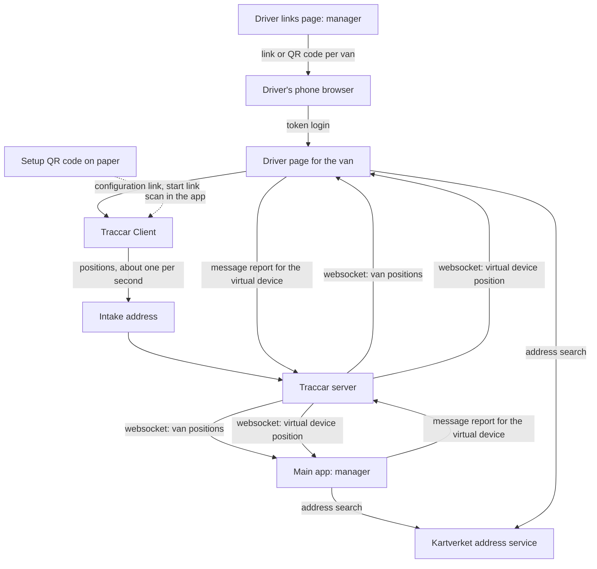
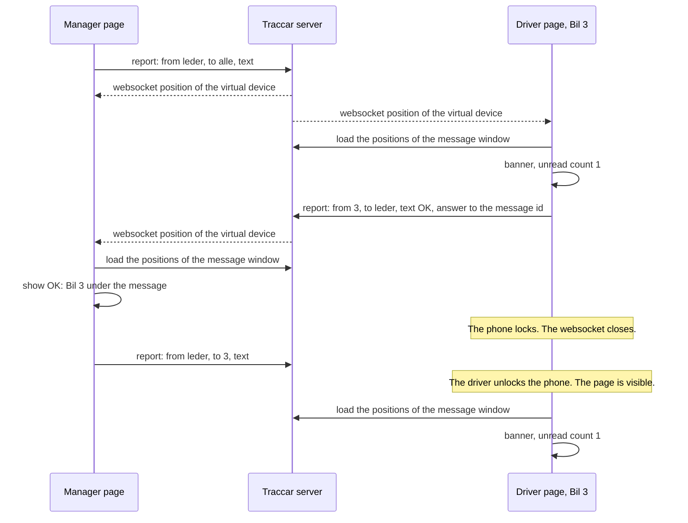

# Driver Page with Tracker Setup and Messages - Plan

## Goal Capsule

- **Objective:** Give each van a link to a driver page in kart.koredu.no. The page sets up the stock Traccar Client with one tap, shows whether the van is tracked, shows the planned routes with the van's route highlighted, and carries messages between the fleet manager and the driver. The main app shows the manager every van that is not tracked.
- **Deadline:** The event on 2026-10-09. Pickup starts at 17:00 Europe/Oslo.
- **Authority:** Product Contract R-IDs win on behavior. Planning Contract KTDs win on mechanism. Units never override either.
- **Stop conditions:**
  - Stop and ask if the configuration link in U1 fails on both test phones.
  - Stop and ask if the user rejects the exposure of the tracker identifiers in U1.
  - Ship without messages if U6 is not rehearsed end to end by 2026-10-06. The manager then uses an SMS group.
  - Ship messages without pins if U9 is not rehearsed by 2026-10-06. The sender then writes the address in the message text.
  - Ship the driver page with the plain map if U12 is not done by 2026-10-04. The setup and the tracking status do not wait for the route highlight.
  - Cut the serviced stretches and the legend from the driver page if the page takes more than about 5 seconds to load on a mid-range phone with the April window (U8).
  - Stop and hand over to the user at each user step in U1, U8 and U11.
- **Execution profile:** Frontend change in this fork. The Traccar server code does not change. The work builds on the branch `feat/planned-routes-progress`. Accounts, tokens and server configuration are user steps.

---

## Product Contract

### Summary

Each van gets a driver link. The link opens a driver page for that van with no login typing. The page configures and starts the stock Traccar Client through two links, and shows a tracking status. The main app lists the vans that are not tracked. The driver page shows the planned routes with the van's main route highlighted. The manager and the drivers write messages to each other. The manager and the drivers can attach a street address to a message. The address shows as a pin on the map of everyone who sees the message.

### Problem Frame

In April, 2 of 9 vans reported a position every 6 to 20 minutes. Their routes showed almost no progress. Nobody saw the problem during the evening.

Drivers set up the tracker by hand: intake address, identifier, accuracy. They have the routes on paper only. The manager reaches a driver by phone call only.

A custom native app needs distribution through the app stores, and there is no time for that. A web page cannot replace the tracker: a browser gives a page positions only while the page is open on the screen.

### Actors

- A1. Fleet manager. An administrator who uses the main app.
- A2. Driver. A volunteer with their own phone, Android or iPhone.
- A3. Traccar Client. The stock app from the app stores, version 10.1.2 or later.

### Key Decisions

- **The stock Traccar Client is the tracker.** (session-settled: user-approved — chosen over tracking from the web page: a web page stops getting positions when the phone locks or the driver switches app.) Governs R5, R6, R8.
- **Directions are handed off to the phone's map app.** (session-settled: user-approved — chosen over building turn-by-turn directions: it needs a routing service and a driving order, and neither exists.) Governs R15.
- **Messages are two-way.** (session-settled: user-directed — chosen over one-way messages from the manager: drivers must be able to answer and to start a message.) Governs R18, R19, R20.
- **All parts target the event on 2026-10-09, each in its smallest version.** (session-settled: user-directed — chosen over the setup link first and the other parts later.) Governs R1–R39.
- **The main map shows the pins.** (session-settled: user-directed — chosen over the address as text only on the main map: the user asked to see the pins on their own map.) Governs R30, R34.
- **Drivers can attach an address too.** (session-settled: user-directed — chosen over addresses from the manager only: the user asked for it.) Governs R29.
- **The driver link logs the driver in with no typing.** (session-settled: user-approved — chosen over drivers typing a login: anyone who gets the link can see the map and write as that van.) Governs R1, R3. Conflict call-out: a link holder can create a new token or a share that outlives a revoked token. The expiration time of the driver account bounds this (KTD2).
- **Messages have no push notification.** (session-settled: user-approved — chosen over web push: a message reaches a driver only while the driver page is open.) Governs R23.
- **A driver sees their own van's messages and the messages to all vans.** (session-settled: user-approved — chosen over a group chat: the filter is in the page, so the messages are hidden, not secret.) Governs R21.

### Requirements

**Driver link and login**

- R1. Each van has a driver link. The link opens the driver page for that van and logs the driver in with no typing.
- R2. The driver page keeps its van after a page reload.
- R3. The driver link works each time it is opened, until its token expires or is revoked.
- R4. One page for administrators lists every van with its driver link as text, its driver link as a QR code, and its tracker setup as a QR code.

**Tracker setup**

- R5. The driver page shows the setup in four steps: install Traccar Client, configure it with one tap, grant the phone permissions, and start tracking with one tap.
- R6. The one-tap configuration sets the intake address, the van's identifier and the tracking settings.
- R7. The setup section shows the intake address and the van's identifier as text that can be copied, for setup by hand.
- R28. The driver page has a link that stops tracking. The driver taps it when the van is done for the evening.
- R38. The setup section tells the driver to stop the tracking after a setup before the event day, and to start it at the base on the event day.

**Tracking status**

- R8. The driver page shows a tracking status for its van. The status has three states: tracked, not tracked, and no contact with the server.
- R9. The status is tracked when the latest position of the van is at most `STATUS_MAX_AGE_S` old. The page shows the age of the latest position.
- R10. The status works before 17:00.
- R11. The setup section is open until the status was tracked once on this phone. After that it stays collapsed, and the driver can open it by hand.
- R35. When the status is not tracked, the driver page shows a "Start sporing" button next to the status, also when the setup section is collapsed. The button shows only on a phone where the status was tracked once (R11). On a first visit, the start is step 4 of the setup.
- R36. From the start of the event day (R25), the main app lists every van that is not tracked, with the age of its latest position. The rule is that of R9. The list works before 17:00, so the manager can check the vans before they leave.
- R39. The manager can mark a van in the list as done. A van that is done leaves the list and the count, and it comes back when it reports again and then stops.

**Driver map**

- R12. The driver page shows the planned routes, the serviced stretches, the legend, and the position markers of all vans. It does not show the van traces.
- R13. The van's main route is highlighted, and the map opens fitted to it. For a van with no main route, the map opens fitted to all routes.
- R14. The driver page has no manual marking, no logout, and no link to the settings.
- R15. The driver page has a link that opens directions to the base in the phone's map app.
- R16. A driver link for an unknown van shows the text "Ukjent bil" and no map.
- R37. On the driver map, the marker of the page's own van is larger than the others, and it always shows the van's name.

**Messages**

- R17. The manager writes a message to one van or to all vans.
- R18. A driver writes a message to the manager.
- R19. A driver answers a message with one tap on "OK". The answer names the message that it answers.
- R20. The manager sees all messages of the event day. Under each message from the manager, the list shows which vans answered OK, which vans have not, and the age of the message.
- R21. A driver sees the messages to their van, the messages to all vans, and the messages that their van sent.
- R22. A new incoming message shows a banner. It counts as unread until the viewer opens the message panel. The banner stays until the viewer taps it or dismisses it, and it does not show while the panel is open. With several unread messages, it shows the latest one and the count.
- R23. A message reaches an open, connected page within seconds. A page that was hidden, closed or offline shows the missed messages when it is visible again.
- R24. When a send fails, the text stays in the field and the page shows an error.
- R25. Messages cover the event day. The event day starts at 04:00 Europe/Oslo and ends at 04:00 the next morning. An open page clears its messages and pins when the event day ends.
- R26. A message text holds at most 500 characters. Norwegian letters arrive unchanged.
- R27. The message panels show only when the virtual device exists. The manager's panel shows for administrators only.

**Message pins**

- R29. The sender of a message, manager or driver, can attach one street address to it. The sender searches for the address and picks it from a list of matches. A message cannot be sent while the address field holds text that is not picked: the sender picks a match or empties the field.
- R30. A message with an address shows as a pin on the map of each viewer who sees the message. The main map shows the pins of all messages, and a driver's map shows the pins of the messages of R21.
- R31. A tap on the pin shows the address, the message text, the sender, the recipient, and a link that opens directions to the pin in the phone's map app. The message in the panel shows the address and the same directions link, and the banner shows the address.
- R32. A tap on a message with an address moves the map to its pin.
- R33. A pin stays until the viewer removes it or the event day ends. A removal applies to that browser only, and the message stays in the list.
- R34. On the main map, each pin carries a label that reads as a destination: the name of its van, an arrow, and the street address, for example "Bil 3 → Tåsenveien 10A". The van is the recipient of a message from the manager, or the sender of a message from a driver. A pin of a message to all vans carries "Alle". The pin has an image that differs from the van markers.

### Acceptance Examples

- AE1. **Covers R1, R2.** Given the driver of Bil 3 opens the driver link from an SMS, when the page has loaded, then it shows the driver page for Bil 3 with no login form, and a reload shows the same page.
- AE2. **Covers R9, R10.** Given the clock is 16:30 and the latest position of the van is 10 seconds old, when the status renders, then it shows tracked and "10 s".
- AE3. **Covers R8, R9.** Given the latest position of the van is 5 minutes old and the page is connected, when the status renders, then it shows not tracked and "5 min".
- AE4. **Covers R8.** Given the page has no connection to the server, when the status renders, then it shows no contact with the server, whatever the age of the latest position.
- AE5. **Covers R11.** Given the status was tracked once on this phone, when the van's phone stops reporting, then the status shows not tracked and the setup section stays collapsed.
- AE6. **Covers R17, R21.** Given the manager sends a message to Bil 3, when the driver pages of Bil 3 and Bil 5 are open, then the page of Bil 3 shows the message and the page of Bil 5 does not.
- AE7. **Covers R19, R20.** Given the manager sent a message to all vans, when the driver of Bil 3 taps "OK" on it, then the manager's list shows "OK: Bil 3" under that message.
- AE8. **Covers R22, R23.** Given a driver's phone is locked when the manager sends a message, when the driver unlocks the phone and the driver page is visible, then the page shows the message, a banner, and an unread count of 1.
- AE9. **Covers R25.** Given one message was sent at 23:50 and one at 01:00, when a page loads at 01:30, then it shows both. When a page loads at 04:30, then it shows neither. A page that stays open from 03:50 to 04:10 shows both at 03:50 and neither at 04:10.
- AE10. **Covers R26.** Given a driver sends the text "10" and then the text "true", when the manager's list renders, then it shows the texts "10" and "true".
- AE11. **Covers R24.** Given the phone is offline, when the driver sends a message, then the page shows an error and the text is still in the field.
- AE12. **Covers R27.** Given the server has no virtual device, when the driver page and the main app render, then they show no message panel and no error.
- AE13. **Covers R29, R30.** Given the manager searches for "Tåsenveien 10", picks "Tåsenveien 10A, 0853 OSLO" and sends the message to Bil 3, when the driver pages of Bil 3 and Bil 5 are open, then the map of Bil 3 shows a pin at that address and the map of Bil 5 does not. The main map shows the pin with the label "Bil 3 → Tåsenveien 10A".
- AE14. **Covers R31.** Given the map of Bil 3 shows a pin, when the driver taps it and then taps the directions link, then the phone's map app opens with the pin as destination.
- AE15. **Covers R33.** Given the driver removes a pin, when the page reloads, then the pin is still gone and the message is still in the list.
- AE16. **Covers R29.** Given the address search gives no match or does not answer, when the sender empties the address field and sends the message, then the message goes out with its text and with no pin.
- AE17. **Covers R29, R30, R34.** Given the driver of Bil 5 attaches an address to a message to the manager, when the message has arrived, then the main map shows the pin with a label that starts with "Bil 5", the map of Bil 5 shows the pin, and the map of Bil 3 does not.
- AE18. **Covers R33.** Given the manager removes a pin on the main map, when the driver page of the receiving van is open, then the driver's map still shows the pin.
- AE19. **Covers R35.** Given the setup section is collapsed and the van's phone stops reporting, when the status turns to not tracked, then the page shows "Start sporing" next to the status. A tap on it starts the tracking, and the button goes away when the status is tracked. Given a first visit on a phone with no setup, then the page shows no "Start sporing" button next to the status.
- AE20. **Covers R36.** Given Bil 6 reported until 18:40 and then stops, when the clock is 18:45, then the main app lists Bil 6 as not tracked with "5 min". At 16:30, a van that does not report is in the list.
- AE21. **Covers R20.** Given the manager sent a message to all vans 6 minutes ago and only Bil 3 answered OK, when the manager's list renders, then it shows "OK: Bil 3", "Mangler:" with the names of the other vans, and "6 min".
- AE22. **Covers R22.** Given two messages arrive while the panel is closed, when the viewer looks at the page a minute later, then the banner still shows, with the latest message and the count 2.
- AE23. **Covers R39.** Given Bil 4 tapped "Stopp sporing" at the base and is in the list, when the manager marks Bil 4 as done, then Bil 4 leaves the list and the count. When Bil 4 reports again and then stops, then Bil 4 is in the list again.
- AE24. **Covers R29.** Given the sender typed "Tåsenveien 10" in the address field and picked no match, when the sender taps send, then the message is not sent, the page shows "Velg adressen fra listen, eller tøm feltet", and the message text is still in its field.

### Scope Boundaries

- The web page does not send positions.
- The plan builds no native app.
- The plan builds no turn-by-turn directions.
- Messages have no push notification and no sound. The page does not keep the screen on.
- Drivers do not write to each other.
- Nobody can place a pin by a tap on the map. A pin comes from an address only.
- A viewer does not see which pins another viewer removed.
- The address search covers Oslo only.
- Messages cannot be edited or deleted.
- Messages are not private, and the sender of a message is not proven.
- The Traccar server code and the database schema do not change.
- The driver page is not an installable app. "Add to home screen" is not supported.
- An expired or revoked driver link ends on the login page.

### Deferred to Follow-Up Work

- A switch that keeps the screen on while the driver page is visible.
- A sound for a new message.
- Automatic login with a stored link when the session is lost.
- A page that explains an expired link.
- Directions to a point that the driver taps on the map.
- A pin placed by a tap on the map.
- A pin at the van's own position, attached with one tap.
- A mark on the main map for a pin that the driver removed.
- The items that the planned-routes plan deferred. R36 covers one of them: the sign for a van with stale positions.

### Open Questions

- Deferred, not blocking the start: Every holder of a driver link can read the tracker identifiers of all vans and of the virtual device. The holder can then send false positions for any van, and false messages in any name. The server has no setting that hides the identifiers. The user confirms or rejects this in U1, before any code depends on the answer. A rejection stops the work.

---

## Planning Contract

### Key Technical Decisions

- KTD1. **The driver page is a route inside the existing app.** The route is `/sjafor/:deviceId`, a child route of `App`. It gets the login check, the stores, the websocket and the theme with no new code. The server already forwards unknown app routes to `index.html`. Rejected: a second HTML entry like `route-editor.html`, which needs its own login and websocket.
- KTD2. **One shared driver account and one token serve every van.** The van's device id is in the path, because `Navigation` removes the `token` parameter from the address. Rejected: one share token per van from `POST /api/share/device`. Such a user sees one device only, so it gets no other vans, no virtual device and no position history.
  - The driver account has an expiration time shortly after the event. Revoking the token is not enough: a link holder can create a new token, create a share, or set a password for the account. The expiration time ends all three.
  - A driver account serves one event. It is never enabled again, because a password or a token that a link holder made would then work again. Each event gets a new account and a new token.
  - The expiration time does not close a connection that is already open. The server checks the account at login only. The archive of the server stops the server, and that ends every open connection.
  - A link holder can revoke the shared token, because the link holds the token text. New logins through every driver link then fail. Operational Notes has the recovery.
- KTD3. **The login session lasts by server configuration, not by code.** A token login creates a normal session that ends at the token's expiry. The setting `web.sessionTimeout` gives the session cookie a lifetime, so a phone keeps it when the browser restarts. Sessions live in the server's memory, so a server restart ends them; a deployment restarts the server. Rejected: storing the link and logging in again from the login page. It changes three shared files, and an expired token can cause a redirect loop.
- KTD4. **The tracker settings live in one pure module.** One parameter set builds both setup forms:
  - The configuration link `org.traccar.client://config?url=<intake address>&id=<uniqueId>&<settings>`. The app asks "Apply new configuration?" before it applies the settings.
  - The setup QR code `<intake address>?id=<uniqueId>&<settings>`. The driver scans it from the settings screen of the app.
  - The start link is `org.traccar.client://action/start`. The stop link is `org.traccar.client://action/stop`.
  - Both forms are verified in the source of Traccar Client `v10.1.2`. U1 verifies them on phones.
- KTD5. **The tracking status reads the session store, not the day traces.** It uses the latest position of the van and the socket state. The day traces are empty before 17:00. The age is the time from the position's `fixTime` to now, never below zero, and it updates every second.
- KTD6. **Messages are reports for the existing virtual device.** The manual-marks device also carries the messages. `marksFromPositions` already ignores a report without mark attributes, and the message loader ignores a report without `msgText`. `isVan` and the device lookup stay unchanged. Rejected: a second virtual device. It needs a change to `isVan`, a change to the mark lookup, and one more device to create and link before each event. Cost of the choice: each message causes one reload of the marks, and each mark causes one reload of the messages. `useManualMarks` does not throttle its reload.
  - The virtual device serves one event. The manager deletes it before the archive, and its reports go with it: the messages, the pickup addresses and the manual marks. The end of the event day only hides them in the page. Each event gets a new virtual device with a new identifier.
- KTD7. **A message report has a fixed format.**
  - Attributes: `msgFrom`, `msgTo`, `msgText`, and `msgRe` on an answer.
  - `msgFrom` is a van's device id or `leder`. `msgTo` is a van's device id, `alle`, or `leder`. `msgRe` is the position id of the answered message.
  - `msgText` starts with the prefix `MSG_PREFIX`. The server stores a value that looks like a number or a boolean as that type; the prefix keeps the text a string. The reader removes the prefix.
  - The report carries the coordinates of `BASE` and no time. The server then stamps it on receipt. Without coordinates, the server copies the time of the last position, and the order is lost.
  - The report is a form-encoded POST body with no query string. `URLSearchParams` percent-encodes the text.
  - The "OK" answer is a message with the text `OK`, the recipient `leder`, and `msgRe`.
- KTD8. **The message list is rebuilt in full from the positions of the virtual device.**
  - The list is ordered by position id, as a number. As text, the id 1000 sorts before the id 999.
  - The ids of vans in `msgFrom` and `msgTo` are compared as strings, for equality only. The server stores a numeric id as a number.
  - A report with a missing field, a wrong type, or a text without the prefix is ignored. The reader never throws.
  - A report with a text longer than `MSG_MAX_LENGTH` is ignored. The intake accepts a body of 64 KiB, so the limit in the sender is not enough.
  - A report is ignored unless its sender is `leder` or a known van, and its recipient is `leder`, `alle` or a known van. The names on the screen come from the device store, never from the report.
  - The list loads when the page mounts, when a websocket position for the virtual device arrives, when the socket reconnects, and when the tab becomes visible.
  - At most one load runs and one load waits. A flood of reports then causes no flood of requests.
  - A failed load is tried again, at most `MSG_LOAD_RETRIES` times. The first delay is `MSG_LOAD_RETRY_S`, and each delay is twice the one before. The retries stop when the page unmounts. Without them, an open page misses a message for good when one load fails and no other message follows.
- KTD9. **Messages have their own time window: the event day of R25.**
  - The window starts at the latest 04:00 Europe/Oslo that is not after the current time, and it ends 24 hours later. A message from 01:00 then belongs to the evening before, and it is gone at 04:00.
  - The page sets a timer for the end of the window. At the end it computes the new window and loads again, so an open page clears without a new report.
  - The URL parameters `from` and `to` override the window, as in `trackingWindow`.
- KTD10. **Visibility and sender are decided in the page.** Every page on the driver account receives every message. The filter of R21 runs in the browser.
- KTD11. **The unread state is the last read position id in local storage.** The key holds the viewer: a van's device id, or `leder`. A message is unread when its id, as a number, is above the last read id. Every read and write of local storage is inside a try and catch.
- KTD12. **The route highlight changes paint properties of the band layer.** An effect calls `setPaintProperty` with the layer id that `useMapLayer` returns. The layer is not added again, so the layer order holds.
- KTD13. **The driver page hides parts by one path check and two props.** `App` leaves out `BottomMenu` when the path starts with `/sjafor/`. `MapView` gets a prop that hides the settings entry of `MapSwitcher`. `MapPlannedRoutes` gets a prop that turns marking off and a prop for the highlighted route.
- KTD14. **Marks and messages share one transport.** `send` moves from `src/map/main/MapPlannedRoutes.jsx` to its own module. The target rule of the planned-routes plan stays: the page's own origin on https, the intake address from the dev server.
- KTD15. **Tests run with `node --test` on pure modules.** `src/driver/driverLink.js` and `src/driver/messages.js` import with explicit `.js` extensions, import no app module, and read `window` only inside functions. The `test` script in `package.json` also covers `src/driver/*.test.js`.
- KTD16. **Labels are hard-coded in Norwegian,** as in the planned-routes feature.
- KTD17. **A message text renders as plain text.** The text is a plain React child with line wrapping. The page detects no links and renders no HTML from a message. The address of a pin renders the same way.
- KTD18. **The address search uses the open address service of Kartverket.** The address is `https://ws.geonorge.no/adresser/v1/sok`, with `kommunenummer=0301` for Oslo. It needs no key, it allows requests from a browser, and it gives a point per house number. The request follows the pattern of `MapGeocoder`: it waits until the typing pauses, and a new request cancels the old one. Rejected: the Nominatim search that `MapGeocoder` uses. It searches the whole world by default, and Kartverket is the official source of Norwegian addresses.
  - The service matches whole words. The search text `Tåsenv 10` gives no match, and `Tåsenv* 10` gives the right ones.
  - The request builder replaces each comma with a space. It adds `*` to every word that has two or more characters and no digit. A word with a digit gets no `*`, because `10*` lists 100 to 102E before 10A.
  - The request sends `ADDRESS_MAX_MATCHES` as `treffPerSide`.
  - The option `fuzzy` of the service is not used. It does not combine with `*`.
- KTD19. **A pin travels in the message report as three attributes.**
  - `msgLat` and `msgLon` are numbers. `msgAddr` is the address text with the prefix `MSG_PREFIX`.
  - The coordinates of the report itself stay at `BASE` (KTD7).
  - The reader gives a message a pin only when `msgLat` and `msgLon` are numbers inside the valid ranges. With a bad pin, the message stays and the pin is dropped.
  - The reader ignores an address longer than `MSG_ADDR_MAX_LENGTH`.
- KTD20. **Pins render with `MapMarkers`, and removed pins live in local storage.**
  - The pins of a viewer are the messages with a pin that the viewer sees, without the removed ones. One pure function serves the driver page and the main map.
  - The removed pins are message ids in local storage, inside a try and catch. The key holds the viewer, as in KTD11.
  - The page that mounts the message panel calls `useMessages` once. It passes the messages to the panel and the pins to the map, so both show the same data from one request.
  - On the main map the pins use the titles of `MapMarkers` for the label of R34. The van's name comes from the device store, never from the report. The street address is the address text of the pin without the postal code and the postal place.
  - The pins use the image `default-info` of `preloadImages`. The van markers use the colors for success, error and neutral, so the pins differ by color, and the label of R34 makes them read as destinations.
  - The pins mount before the position markers, so a van marker lies on top of a pin.
  - The directions link reuses the link builder of U2 with the pin as destination.
- KTD21. **The list of untracked vans reuses the status function of the driver page.**
  - The main app applies the function of KTD5 to every van. A van with no position counts as not tracked.
  - The list runs in the window of KTD9, not in the tracking window of the planned-routes plan. It then works before 17:00, and an empty list means that every van reports.
  - The list is for live use. It reads the latest positions of the session store and the current time. With a window that ended before the current time, the list is empty, as marking is off in `useManualMarks`.
  - The vans that are done (R39) are device ids in local storage, inside a try and catch. A van loses its done mark when its status is tracked again.

### Tracker Settings and Constants

U1 checks the start values on phones.

| Name | Start value | Meaning |
|---|---|---|
| `accuracy` | `highest` | Location accuracy of Traccar Client |
| `distance` | `0` | No distance filter |
| `interval` | `1` | Seconds between positions |
| `stop_detection` | `false` | The app keeps reporting when the van stands still |
| `wakelock` | `true` | Android only: the app keeps the phone awake |
| `buffer` | `true` | The app stores positions while the network is down |
| `STATUS_MAX_AGE_S` | 60 s | Maximum age of the latest position for the status tracked |
| `MSG_MAX_LENGTH` | 500 | Maximum length of a message text |
| `MSG_PREFIX` | `t:` | Prefix of every message text and address text in a report |
| `MSG_LOAD_RETRIES` | 5 | Maximum number of retries after a failed load of the messages |
| `MSG_LOAD_RETRY_S` | 2 s | Delay before the first retry |
| `MSG_ADDR_MAX_LENGTH` | 100 | Maximum length of the address text of a pin |
| `ADDRESS_MUNICIPALITY` | `0301` | Municipality number of Oslo, for the address search |
| `ADDRESS_MAX_MATCHES` | 10 | Maximum number of matches in the list |

### High-Level Technical Design

Components and data flow:

A message with an answer, and a message that a locked phone missed:

The tracking status:

| State | Condition | Text on the page |
|---|---|---|
| No contact with the server | The socket state is off | "Ingen kontakt med serveren" |
| Tracked | The socket state is on, and the latest position is at most `STATUS_MAX_AGE_S` old | "Bilen spores", with the age |
| Not tracked | The socket state is on, and the van has no position or an older one | "Bilen spores ikke", with the age when there is one |

### Assumptions

- The live server behaves like the upstream source at version 6.16.0. U1 checks its version and its `traccar.xml`.
- The server has no position filter that drops two reports from the same place. The mark transport spike of the planned-routes plan showed this.
- The virtual device for manual marks exists, and the planned-routes feature is deployed before this work.
- Each van's phone has a charger in the van.
- Drivers open the link in Safari or Chrome.

### Risks

| Risk | Mitigation |
|---|---|
| The configuration link does not open the app from an in-app browser, for example in Messenger. | The manager sends links by SMS. The setup QR code and the text of R7 are the fallback. U1 tests the common paths. |
| The driver does not grant location access "Always", or a battery saver stops the app. No link can set this. | Step 3 of the setup names the settings for Android and iPhone. The tracking status shows the result within a minute. |
| A phone reports with the screen on and stops when it is locked. Every check by the driver passes, because the driver looks at the page with the screen on. | The checklist has a test at the base: every driver starts the tracking and locks the phone, and the manager reads the list of untracked vans after 3 minutes. |
| The list of untracked vans holds a test device or a van that does not drive. The manager then learns to ignore the list. | The checklist deletes the test device and removes the access to every van that does not drive. The manager marks a finished van as done (R39). |
| A message reaches nobody, because the phone is locked or another app is in front. | The manager sees which vans answered OK. No OK within 5 minutes means a phone call. |
| Every holder of a driver link can read the identifiers of all vans and of the virtual device, and can send false positions and false messages. | The driver account expires shortly after the event (KTD2). The identifiers of the vans and of the virtual device can be changed if abuse is suspected. |
| Someone sends a false message in the manager's name, or false OK answers. | Accepted. Only link holders can do it. An instruction that changes the evening's plan is confirmed by phone. |
| The token is created in the administrator's login. Every driver link then gives administrator access, and the driver page hides every sign of it. | The checklist tests one link in a private window and reads `/api/session` there. It must show the driver account. |
| A link holder revokes the shared token. New logins through every driver link then end on the login page. | Operational Notes has the recovery: a new token and new links by SMS. It takes minutes. |
| A link holder keeps a driver page open after the account expires, and still gets the positions of the vans. | The server is archived no later than 12:00 on 2026-10-10. The archive stops the server. |
| A phone reports before or after the event. It then shows the volunteer's private movements to every link holder, and drains the battery. | The setup text of R38 and the stop link of R28. The checklist tells drivers to stop after the setup and at the base when done. The server is archived after the event. |
| A printed sheet or a forwarded SMS gives the token to an outsider. | The sheets stay in the vans, out of sight, and are destroyed after the event. The expiration time of the driver account bounds the access. |
| A server restart logs out every driver and the manager. A deployment restarts the server. | The links go out after the core rehearsal, before the deployment of the messages. That deployment costs each driver one tap on the link. No deployment and no restart after 16:00 on the event day. |
| The address service does not answer, or gives no match for a new or unusual address. | The message goes out without a pin (AE16). The manager writes the address in the text. |
| The sender picks the wrong match, for example 10B for 10A, and the driver goes to the wrong door. | The list shows the full address with the postal code. The sender's map moves to the picked address before the message is sent. On a phone, where the panel covers the map, the button "Vis på kartet" shows the place and keeps the draft. |
| A driver finds the address search hard to use on a phone in the dark. | The address is optional. A driver can write the address in the text, or call. |
| Many pins clutter the main map late in the evening. | The manager removes a pin when its job is done (R33). The page hides the pins when the event day ends. |
| A pin shows the home address of a private person to every link holder. | Accepted for the event: the manager can write the same address in the text. The page hides a pin when the event day ends, and the driver account expires after the event. |
| The pickup addresses stay in the database and in the archive after the event. The drivers of the next event could read them. | The manager deletes the virtual device before the archive (KTD6). Its reports go with it: the messages, the addresses and the manual marks. |
| A flood of reports for the virtual device slows every page. Beyond 50,000 positions in the window, new messages and marks are lost. | Accepted. KTD8 limits the reloads. The fallback is the SMS group and a new virtual device. |
| Two phones report for one van, and the interleaved positions erase the van's stops. | One phone tracks per van, and it stays in the van. When the status is tracked, the setup section says "Bilen spores allerede". |
| Each driver page loads the history of every van. Late in the evening this is tens of MB per reload. | U8 measures the load on a phone. The stop condition cuts the serviced stretches and the legend. |
| A deployment reaches an open page only after a tap on the update notice. | No deployment after 16:00 on the event day. The checklist tells the drivers to open the link again on the event day, which loads the latest build. |
| A report dated up to 24 hours in the future stops the push of later reports for that device. On the virtual device, messages and marks wait for the next reload. On a van, the marker freezes and the status shows tracked. | Accepted; it takes a deliberate act by a link holder. For the virtual device, the recovery of the planned-routes plan applies. The setting `filter.future` can lower the limit, but it then drops every position of a phone whose clock runs ahead of the limit. |
| The manager opens a driver link in the normal browser and loses the administrator session. | The manager tests driver links in a private window. |
| A message longer than the database column is shown live but not stored. | `MSG_MAX_LENGTH` is far below the limit of 4,000 characters for all attributes of a report. |

### Delivery Order and Cut Lines

| Date | Milestone | If it is missed |
|---|---|---|
| 2026-10-01 | U1: the setup links are tested on two phones, and the driver account and a test token exist | Setup uses the QR code of the device page. The driver page has no setup buttons. |
| 2026-10-04 | U2, U3, U4, U7: the driver page with the plain map, the setup, the status and the links page are deployed | Drivers use the main app with the read-only account. |
| 2026-10-04 | U10: the list of untracked vans is deployed | The manager checks the van markers by hand before and during the event. |
| 2026-10-04 | U12: the route highlight and the own van marker are deployed | The driver page ships with the plain map. |
| 2026-10-05 | U8: the core rehearsal is done, and the links are sent to the drivers | — |
| 2026-10-06 | U5, U6: messages are rehearsed end to end | The event runs without messages. The manager uses an SMS group. |
| 2026-10-06 | U9: message pins are rehearsed | Messages go out without pins. The sender writes the address in the text. |
| 2026-10-07 | U11: the messages and the pins that passed are rehearsed on phones and deployed | The event runs without the part that failed. |
| 2026-10-09 16:00 | Last moment for a deployment | — |

The order of the units in time is U1, U2, U3, U4, U7, U10, U12, U8, U5, U6, U9, U11. The setup, the status and the links come first, because they fix what failed in April.

---

## Implementation Units

### Phase A: Proof on real phones

### U1. Phone test of the tracker setup

**Goal:** Prove on real phones that the setup links and the setup QR code configure and start Traccar Client, before anything is built on them. Set up the driver account, and settle the open question, so that every later unit tests with a real driver link.

**Requirements:** R1, R5, R6. KTD2, KTD4.

**Dependencies:** None.

**Files:**
- Modify `docs/plans/2026-09-29-001-feat-driver-page-messages-plan.md`: record the result in Sources and correct the table of tracker settings.

**Approach:**
1. Ask the user which settings the phones had that reported once per second in April.
2. Use one Android phone and one iPhone with Traccar Client from the app stores, and a test device on the server.
3. Send the configuration link and the start link to each phone by SMS. Open them from the SMS app.
4. Repeat from a QR code scanned with the camera, and from a link in Messenger.
5. Scan the setup QR code from the settings screen of the app.
6. After each path, read the settings screen of the app and compare every value.
7. Let each phone track for 10 minutes with the screen locked, 5 of them standing still. Count the positions on the server.
8. Note every permission dialog that the app shows on first start, per platform.
9. Ask the user to confirm or reject the open question on the tracker identifiers. Record the answer in Open Questions. A rejection stops the work (Goal Capsule).
10. Ask the user to read the version of the live server on the preferences page, as administrator, and to show its `traccar.xml`. Record both in Sources. If the version is not 6.16.0, check the claims under "Traccar server" in Sources against the source of that version before U3 starts.
11. Ask the user to do the steps "At the phone test" of Operational Notes: the driver account with its settings, its expiration date and its access, and a test token.

**Execution note:** This is a spike with the user. It leaves no code in the repo.

**Test expectation:** none — the spike produces a decision, not code.

**Verification:**
- Sources names, per platform, which paths configure the app and which fail.
- The 10-minute run gave about one position per second, also at standstill. If not, the table holds the corrected settings.
- Open Questions holds the user's answer, and Sources holds the version of the live server.
- The test token logs in as the driver account.

### Phase B: Driver page

### U2. Driver link and tracker settings module

**Goal:** Pure functions for the driver link, the two setup forms, the start and stop links, the directions link and the tracking status.

**Requirements:** R1, R4, R6, R8, R9, R15, R28. KTD4, KTD5, KTD15.

**Dependencies:** U1.

**Files:**
- Create `src/driver/driverLink.js`.
- Create `src/driver/driverLink.test.js`.
- Modify `package.json`: the `test` script also runs `src/driver/*.test.js`.

**Approach:**
1. The module holds the tracker settings and `STATUS_MAX_AGE_S` from the table above.
2. It imports `INTAKE_URL` and `BASE` from `src/map/main/plannedRoutes.js`.
3. It builds the driver link from an origin, a device id and a token.
4. It builds the configuration link and the setup QR address from a `uniqueId`, from the same parameter set. It holds the start link and the stop link.
5. It builds the directions link to a given point. The driver page uses it for `BASE`, and U9 uses it for a pin. The form `https://www.google.com/maps/dir/?api=1&destination=<lat>,<lon>` opens the map app on both platforms.
6. It returns the tracking status from the latest position, the socket state and the current time, per the status table.

**Execution note:** Implement test-first.

**Patterns to follow:** `src/map/main/plannedRoutes.js` and `src/map/main/plannedRoutes.test.js`.

**Test scenarios:**
- The driver link for device id 12 and token `abc` has the path `/sjafor/12` and the parameter `token=abc`.
- A token with the characters `+`, `/` and `=` is percent-encoded in the driver link.
- The configuration link starts with `org.traccar.client://config?` and carries the intake address percent-encoded in `url`.
- The configuration link and the setup QR address carry the same settings with the same values.
- The setup QR address starts with the intake address and carries `id`.
- A `uniqueId` with a space or `&` is percent-encoded in both forms.
- The start link is `org.traccar.client://action/start`, and the stop link is `org.traccar.client://action/stop`.
- The directions link carries the latitude before the longitude.
- Covers AE2. A position 10 seconds old with the socket on gives tracked and an age of 10 seconds.
- Covers AE3. A position 5 minutes old with the socket on gives not tracked and an age of 300 seconds.
- A position exactly `STATUS_MAX_AGE_S` old gives tracked.
- No position with the socket on gives not tracked and no age.
- Covers AE4. A position 10 seconds old with the socket off gives no contact with the server.
- A position with a `fixTime` 30 seconds in the future gives tracked and an age of 0.

**Verification:** `npm test` passes.

### U3. Driver page with the map

**Goal:** A phone-first page per van that shows the map of R12, fitted to the van's route. The route highlight and the own van marker come in U12, so the setup and the status of U4 do not wait for them.

**Requirements:** R1, R2, R12, R13, R14, R16. KTD1, KTD13, KTD16.

**Dependencies:** U1, for the driver account and the test token.

**Files:**
- Create `src/driver/SjaforPage.jsx`.
- Modify `src/Navigation.jsx`: add the route `sjafor/:deviceId` under `App`. The name `DriverPage` is taken there by `src/settings/DriverPage.jsx`.
- Modify `src/App.jsx`: leave out `BottomMenu` on the driver page.
- Modify `src/map/core/MapView.jsx` and `src/map/control/MapSwitcher.jsx`: a prop hides the settings entry.
- Modify `src/map/main/MapPlannedRoutes.jsx`: a prop turns marking off.

**Approach:**
1. The page reads the device id from the path and finds the device in the device store.
2. It shows "Ukjent bil" when the devices have loaded and the id is no van (`isVan`).
3. It calls `useTrackingWindow`, `useDayTraces` and `useRouteIndex`, as `MainMap` does.
4. It mounts `MapView` with `MapPlannedRoutes` and `MapPositionMarkers`. The markers show the positions of all vans. It does not mount `MapRouteTraces` or `MapDefaultCamera`.
5. The map fits the bounds of the stretches of the van's main route once, when the route index has loaded. The main route is `mainRouteOf(device)`. With no main route it fits all stretches.
6. The layout at 375 px width has a fixed order:
   - The header shows the van's name and the tracking status of U4.
   - The map fills the rest of the screen.
   - The message button of U6, with its unread count, is pinned at a corner of the map.
   - The setup, the directions link and the stop link of U4 sit in a sheet at the bottom of the screen. The sheet starts collapsed after R11.
   - The banner of U6 shows at the top of the map, below the header.
   - The legend starts collapsed.

**Patterns to follow:** `src/main/MainMap.jsx` for the hooks and the mount order. `src/other/GeofencesPage.jsx` for a page with a map outside `MainPage`.

**Test scenarios:**
- Covers AE1. Integration (manual): a driver link opens the driver page for its van with no login form. A reload shows the same page.
- Integration (manual): the path `/sjafor/99999` shows "Ukjent bil".
- Integration (manual): the path with the id of the virtual device shows "Ukjent bil".
- Integration (manual): a van with `route` 3 opens fitted to route 3.
- Integration (manual): a van with no `route` opens fitted to all routes.
- Integration (manual): a tap on a band does nothing, and the legend has no marking button.
- Integration (manual): at 375 px width the page has no bottom menu, and the map switcher has no settings entry.
- Integration (manual): the main map still shows the bottom menu on a phone, the settings entry, and the marking button.
- Integration (manual): after a switch of the map style, the bands lie below the stripes and the markers.
- Integration (manual): at 375 px width, the header, the map, the message button and the collapsed sheet are all visible with no scrolling, and nothing covers the tracking status.

**Verification:** The driver page shows the map of R12 for its van. The main map is unchanged.

### U4. Tracking status and setup section

**Goal:** Show whether the van is tracked, and take the driver through the setup and the stop.

**Requirements:** R5, R6, R7, R8, R9, R10, R11, R15, R28, R35, R38. KTD4, KTD5, KTD16.

**Dependencies:** U1, U2, U3.

**Files:**
- Create `src/driver/DriverSetup.jsx`.
- Modify `src/driver/SjaforPage.jsx`.

**Approach:**
1. The status reads the van's latest position and the socket state from the session store, and takes the state from the function of U2. A timer updates the age every second.
2. The setup section has four steps:
   - Step 1 links to Traccar Client in the App Store and in Google Play. The addresses come from https://www.traccar.org/client/.
   - Step 2 is the configuration link. The text says that the app asks a question in English, and that the answer is "OK".
   - Step 3 names the settings per platform, from the result of U1: location access "Always" and precise location on iPhone, location "Allow all the time" and no battery optimisation on Android.
   - Step 4 is the start link.
3. The section shows the intake address and the `uniqueId` as text with a copy button (R7).
4. The section says "Bilen spores allerede" when the status is tracked.
5. A flag in local storage, per van, records that the status was tracked once (R11). The read and the write are inside a try and catch.
6. The page shows the directions link of U2.
7. The collapsed section shows the stop link with the label "Stopp sporing" (R28). The link asks for a confirmation in the page before it opens the app, so a stray tap does not stop the tracking.
8. If U1 showed that a link fails on a platform, that step shows the text of R7 and an instruction to scan the setup QR code.
9. When the status is not tracked and the flag of step 5 is set, a "Start sporing" button with the start link shows next to the status (R35). It does not show in the states tracked and no contact with the server. It does not show on a first visit: a start before the setup makes the app report to the demo server of its defaults.
10. Below step 4, the section shows the text of R38: stop the tracking after a setup before the event day, and start it at the base on the event day.

**Test scenarios:**
- Covers AE2. Integration (manual): before 17:00, a phone that reports shows tracked with an age of a few seconds.
- Covers AE19. Integration (manual): with the section collapsed, stopping the app shows "Start sporing" next to the status. A tap on it starts the tracking, and the button goes away.
- Integration (manual): with the network off, the page shows no "Start sporing" button.
- Covers AE19. Integration (manual): in a private window, the first visit shows no "Start sporing" button next to the status. Step 4 of the setup has the start link.
- Covers AE5. Integration (manual): after the status was tracked, stopping the app turns the status to not tracked within `STATUS_MAX_AGE_S`, and the section stays collapsed.
- Covers AE4. Integration (manual): with the network off, the status shows no contact with the server.
- Integration (manual): on a phone with Traccar Client, step 2 opens the app with the question, and the settings screen then shows the intake address and the van's identifier.
- Integration (manual): step 4 starts tracking, and the status turns to tracked.
- Integration (manual): "Stopp sporing" asks for a confirmation, then stops the tracking in the app, and the status turns to not tracked within `STATUS_MAX_AGE_S`.
- Integration (manual): in a private window, the section is open on the first visit.
- Integration (manual): the directions link opens the map app with the base as destination.

**Verification:** A phone with no setup reaches the status tracked with the four steps and no typing.

### U7. Driver links page for the manager

**Goal:** Give the manager every driver link and setup QR code on one page.

**Requirements:** R4. KTD2, KTD4, KTD16.

**Dependencies:** U2. U1, for the test token.

**Files:**
- Create `src/driver/DriverLinksPage.jsx`.
- Modify `src/Navigation.jsx`: add the route `sjaforlenker` under `App`.

**Approach:**
1. The page renders for administrators only.
2. A field takes the token of the driver account. The token stays in the component state. It is not stored and not written to the repo. The field is a plain text field outside a form, with autocomplete off. A password field makes the browser offer to save the token over the administrator's login.
3. For every van, sorted by name, the page shows the name, the driver link with a copy button, the driver link as a QR code, and the setup QR code. The driver link is text, not an anchor: one click on an anchor replaces the administrator session.
4. Each van is one block that prints on its own page. The block shows the van's name in large text.
5. Each QR code has a short instruction below it, and the two codes stand apart. The driver QR code has "Skann med kamera: åpner sjåførsiden". The setup QR code has "Skann i Traccar Client: setter opp sporing".
6. The QR codes use `QRCode` from `react-qr-code` with `theme.dimensions.qrCodeSize`.
7. Without a token the page shows the setup QR codes and no driver links.

**Patterns to follow:** `src/common/components/QrCodeDialog.jsx`.

**Test scenarios:**
- Integration (manual): with a token, the link of each van opens that van's driver page in a private window.
- Integration (manual): in that private window, `/api/session` shows the driver account, with `administrator` false and `readonly` true.
- Integration (manual): the printed sheet shows the van's name in large text and the instruction below each QR code.
- Integration (manual): the driver QR code, scanned with a phone camera, opens the same page.
- Integration (manual): the setup QR code, scanned from the settings screen of Traccar Client, sets the intake address and the van's identifier.
- Integration (manual): the virtual device is not in the list.
- Integration (manual): the read-only account and the driver account see no links on the page.
- Integration (manual): the print preview shows one van per page.

**Verification:** The manager prints one sheet per van and copies each link into an SMS.

### U10. List of untracked vans for the manager

**Goal:** Show the manager, in the main app, every van that is not tracked, before the vans leave and during the evening.

**Requirements:** R36, R39. KTD5, KTD9, KTD21.

**Dependencies:** U2.

**Files:**
- Modify `src/driver/driverLink.js` and `src/driver/driverLink.test.js`.
- Create `src/driver/UntrackedVans.jsx`.
- Modify `src/main/MainPage.jsx`: mount the list.

**Approach:**
1. `driverLink.js` returns the untracked vans from the devices, the latest positions, the current time, the window of KTD9 and the vans that are done. Each entry has the van and the age of its latest position. The list is sorted by van name.
2. The function skips the virtual device (`isVan`) and the vans that are done. It returns an empty list when the window ended before the current time (KTD21).
3. The function returns the done marks to keep: a van loses its mark when its status is tracked.
4. `UntrackedVans` shows a chip with the count, for example "2 biler spores ikke". A tap opens the list with the name and the age of each van. With an empty list, the chip does not show.
5. Each van in the list has a "Ferdig" button (R39). Below the list, a line names the vans that are done, each with a button that takes the mark away.
6. The chip shows a text and an icon, not a color alone. At 375 px width it does not cover the legend or the map controls.
7. A timer updates the list every second, as the status of U4 does.
8. When the page has no contact with the server, the chip shows "Ingen kontakt med serveren" in place of the count.
9. A tap on a van in the list selects the van, as a tap in the device list does.

**Execution note:** Implement the function test-first.

**Patterns to follow:** The status function of U2. `src/map/main/RouteLegend.jsx` for a small panel on the main map.

**Test scenarios:**
- Covers AE20. At 18:45, a van with a latest position from 18:40 is in the list with an age of 300 seconds.
- A van with a latest position 10 seconds old is not in the list.
- A van with no position is in the list with no age.
- Covers AE20. At 16:30, a van with no position is in the list.
- The virtual device is never in the list.
- With a `to` before the current time, the list is empty.
- Two untracked vans come in the order of their names.
- Covers AE23. A van with a done mark and a latest position 10 minutes old is not in the list, and it keeps its mark.
- Covers AE23. A van with a done mark and a latest position 10 seconds old loses its mark. When its position is 5 minutes old again, the van is in the list.
- Integration (manual): stopping the app on a test phone puts its van in the list within `STATUS_MAX_AGE_S`. Starting it again takes the van out.
- Covers AE23. Integration (manual): "Ferdig" takes a van out of the list and the count, and the mark holds after a reload. The button on the line of done vans puts the van back.
- Integration (manual): at 10:00 on a day with no tracking, the chip shows every van.
- Integration (manual): at 375 px width, the chip, the legend and the map controls do not overlap.
- Integration (manual): with the network off, the chip shows "Ingen kontakt med serveren".

**Verification:** `npm test` passes. The manager sees a van that stops reporting within a minute, with no tap.

### U12. Route highlight and own van marker

**Goal:** Make the van's own route and the van's own marker stand out on the driver map.

**Requirements:** R13, R37. KTD12.

**Dependencies:** U3.

**Files:**
- Modify `src/map/main/MapPlannedRoutes.jsx`: a prop names the highlighted route.
- Modify `src/map/MapPositionMarkers.jsx`: a prop names the van whose marker stands out.
- Modify `src/map/MapMarkers.js`: a prop scales the icon.
- Modify `src/driver/SjaforPage.jsx`.

**Approach:**
1. The highlighted route is `mainRouteOf(device)`. The highlight raises the opacity of that band and lowers the opacity of the others (KTD12).
2. `MapPositionMarkers` draws the named van in its own `MapMarkers`, with no clustering, with the larger scale, and with its title always on. It does the same today for the selected device.
3. `MapMarkers` sets one icon size for its whole layer, so the scale is a prop of the layer, not of one marker.
4. The other markers look as on the main map, and the main map passes no van.

**Patterns to follow:** The second `MapMarkers` for the selected device in `src/map/MapPositionMarkers.jsx`.

**Test scenarios:**
- Integration (manual): a van with `route` 3 shows the band of route 3 stronger than the others.
- Integration (manual): a van with no `route` shows all bands the same.
- Integration (manual): after a switch of the map style, the highlight holds, and the bands lie below the stripes and the markers.
- Integration (manual): the marker of the page's van is larger than the others and shows its name.
- Integration (manual): with all vans at the base and the map zoomed out, the marker of the page's van and its name show outside the cluster bubble.
- Integration (manual): on the main map, all markers and clusters look as before.

**Verification:** A driver finds the own route and the own van on the map at a glance. The main map is unchanged.

### Phase C: Core rehearsal

### U8. Core rehearsal and event checklist

**Goal:** Finish the setup of the live server for the drivers, rehearse the setup and the tracking on phones, and measure the load. The links go out to the drivers after this unit. It does not wait for the messages and the pins.

**Requirements:** R1, R3, R12, R36. KTD2, KTD3.

**Dependencies:** U4, U7, U10. U12 when it made its cut line.

**Files:**
- Modify `docs/plans/2026-09-29-001-feat-driver-page-messages-plan.md`: record the results in Sources and correct Operational Notes.

**Approach:**
1. Ask the user to do the steps "Before the event" of Operational Notes on the live server: the session setting and the final token. U1 created the driver account.
2. Rehearse on one Android phone and one iPhone: driver link, setup, status tracked, and a drive with two stops.
3. Lock each phone for 30 minutes during the rehearsal. Count the positions on the server for that time. The gaps in April were 6 to 20 minutes.
4. Measure the load of the driver page on a mid-range phone on mobile data, with the April window in `from` and `to`. Apply the stop condition of the Goal Capsule.
5. Restart the browser on each phone and open the driver page from the browser history. Check that the session holds.
6. Stop the app on one phone, and check that the main app lists its van as not tracked. Mark the van as done, and check that it leaves the list.
7. Stop the server with a driver page open, as the archive does. Check that the page shows no contact with the server, and that it gets no positions. Start the server again. Do this before the links go out.
8. Ask the user to send the links to the drivers, per Operational Notes.

**Execution note:** This unit needs the live server, the user and two phones. It is a rehearsal, not unit coverage.

**Test expectation:** none — rehearsal against the live server.

**Verification:** Sources holds the result of each step. The user confirms that the setup and the tracking are ready for the drivers.

### Phase D: Messages

### U5. Message module

**Goal:** Pure functions that build a message report and turn positions into the message list of a viewer.

**Requirements:** R17, R18, R19, R20, R21, R22, R25, R26. KTD7, KTD8, KTD9, KTD10, KTD11, KTD15.

**Dependencies:** None.

**Files:**
- Create `src/driver/messages.js`.
- Create `src/driver/messages.test.js`.

**Approach:**
1. The module builds the report body from the `uniqueId` of the virtual device, the sender, the recipient, the text and the answered id (KTD7).
2. It rejects an empty text and a text longer than `MSG_MAX_LENGTH`.
3. It turns the positions of the virtual device into messages with id, time, sender, recipient, text and answered id (KTD8). It takes the ids of the known vans as input.
4. It filters the messages for a viewer (R21). The manager sees all.
5. It lists, per message from the manager, the vans that answered OK and the vans that have not (R20). For a message to one van, that van is expected to answer. For a message to `alle`, every known van is.
6. It counts the unread messages of a viewer from the last read id (KTD11). A message that the viewer sent is never unread.
7. It returns the message window for a given time and URL search string, with its start and its end (KTD9).
8. It returns the delay before a retry of a failed load, or no delay when the retries are used up (KTD8).

**Execution note:** Implement test-first. The rules of KTD7 and KTD8 are the product; the tests pin them down.

**Patterns to follow:** `src/map/main/manualMarks.js` and `src/map/main/manualMarks.test.js`.

**Test scenarios:**
- A report from `leder` to van 3 carries `id`, `lat`, `lon`, `msgFrom`, `msgTo` and `msgText`, and no time.
- The report carries the coordinates of `BASE`.
- Covers AE10. The texts `10` and `true` are sent with the prefix, and the reader returns `10` and `true`.
- Covers R26. The text `Kjør til Tåsen, så ferdig` survives the report body and the reader unchanged.
- An empty text and a text of spaces only are rejected.
- A text of 500 characters is accepted. A text of 501 characters is rejected.
- An OK answer carries the text `OK`, the recipient `leder` and the answered id.
- The reader orders messages by position id, not by fix time.
- The messages with the ids 999 and 1000 come in that order.
- With the last read id 999, the message 1000 counts as unread.
- The reader accepts `msgFrom` and `msgTo` as the number 3 and as the string `3`.
- A position with mark attributes and no `msgText` gives no message.
- A position with a `msgText` without the prefix, a numeric `msgText`, or a missing `msgTo` gives no message and does not throw.
- A position with a text of 5,000 characters gives no message.
- A position with the sender `sjef`, or with the id of an unknown van as sender or recipient, gives no message.
- The texts `<b>x</b>` and `https://example.com` come back from the reader unchanged.
- Covers AE6. A message to van 3 is visible to van 3 and to the manager, and not to van 5.
- A message to `alle` is visible to every van and to the manager.
- A message from van 3 to `leder` is visible to van 3 and to the manager, and not to van 5.
- Covers AE7. After OK answers from van 3 and van 5 to message 120, the message lists both vans.
- Two OK answers from van 3 to the same message list van 3 once.
- An OK answer to an unknown message id is a normal message and does not throw.
- Covers AE21. For a message to `alle` with the known vans 3, 5 and 7 and an OK answer from van 3, the vans 5 and 7 have not answered.
- For a message to van 3 with no answer, van 3 has not answered, and no other van is expected.
- A message from a driver has no list of expected answers.
- The delay before the first retry is `MSG_LOAD_RETRY_S`, and the delay before the second is twice that. After `MSG_LOAD_RETRIES` retries there is no further retry.
- With the last read id 120, the messages 121 and 122 to the viewer count as 2 unread.
- A message that the viewer sent does not count as unread.
- With no last read id, every incoming message counts as unread.
- Covers AE9. At 01:30 on 10 October, the window runs from 04:00 on 9 October to 04:00 on 10 October. At 04:30 it runs from 04:00 on 10 October to 04:00 on 11 October.
- Covers AE9. A message from 23:50 and a message from 01:00 are inside the window at 01:30, and outside it at 04:30.
- At 04:00 exactly, the window starts at that time.
- The window starts at 04:00 Europe/Oslo in summer time and in winter time, and on the two days when the clock changes.
- With `from` and `to` in the search string, the window has those times.

**Verification:** `npm test` passes.

### U6. Message transport and panels

**Goal:** Send and receive messages in the driver page and in the main app.

**Requirements:** R17, R18, R19, R20, R21, R22, R23, R24, R27. KTD6, KTD8, KTD11, KTD14, KTD16, KTD17.

**Dependencies:** U3, U5.

**Files:**
- Create `src/map/main/sendReport.js`: the `send` function, moved.
- Modify `src/map/main/MapPlannedRoutes.jsx`: import `send`.
- Create `src/driver/useMessages.js`.
- Create `src/driver/MessagePanel.jsx`.
- Modify `src/driver/SjaforPage.jsx`.
- Modify `src/main/MainPage.jsx`: mount the panel for administrators.

**Approach:**
1. `useMessages` finds the virtual device with the lookup that `useManualMarks` uses.
2. It loads the positions of the message window and rebuilds the list on the triggers of KTD8. A counter drops a stale response, as `useManualMarks` does. It tries a failed load again with the delays of U5. At the end of the window it computes the new window and loads again (KTD9).
3. It returns the messages of the viewer, the unread count, a send function and a function that marks all as read. The page that mounts the panel calls the hook and passes the result to the panel (KTD20).
4. The panel opens from a button with the unread count. On a phone the panel fills the screen. The panel keeps its draft when it closes: the text comes back when the panel opens again.
5. The panel shows the messages with the oldest first, each with its time, and it opens scrolled to the newest. With no messages it shows "Ingen meldinger". When the load fails after the retries, it shows one line of error text with a button that loads again.
6. The manager's panel has a recipient choice: "Alle biler", or one van by name. Under each message from the manager it shows "OK:" with the vans that answered, "Mangler:" with the vans that have not, and the age of the message (R20).
7. The driver's panel has a text field, and an "OK" button on each incoming message that the van did not answer. The button is disabled while the answer is in flight. A failed answer shows an error and keeps the button. After a success, the label "OK sendt" takes the place of the button.
8. While a send is in flight, the send button is disabled. A failed send shows the error and keeps the text (R24).
9. A new incoming message shows a banner with the sender and the start of the text. A tap on the banner opens the panel. The banner follows R22: it stays until a tap or a dismissal, it shows the latest message and the count, and it does not show while the panel is open.
10. Opening the panel stores the last read id (KTD11).
11. The button and the panel do not render when no virtual device exists, and the manager's panel does not render for a user who is no administrator (R27).

**Patterns to follow:** `useManualMarks` and `run` in `src/map/main/MapPlannedRoutes.jsx` for the load, the reload and the error handling. `useAdministrator` in `src/common/util/permissions.js`.

**Test scenarios:**
- Covers AE6. Integration (manual): a message from the manager to one van shows on that van's page within seconds, and not on another van's page.
- Integration (manual): a message to "Alle biler" shows on two driver pages.
- Integration (manual): the texts `<b>x</b>` and `https://example.com` show as typed, in the list and in the banner, with no bold text and no link.
- Integration (manual): a text of 500 characters with no spaces wraps inside the panel at 375 px width.
- Covers AE7. Integration (manual): a tap on "OK" shows "OK" with the van's name under the message in the manager's panel, and "OK sendt" takes the place of the button on the driver page.
- Covers AE21. Integration (manual): a message to "Alle biler" shows "Mangler:" with every van, and a van leaves that list when it answers OK.
- Covers AE22. Integration (manual): two messages arrive while the panel is closed. The banner shows the latest one and the count 2, and it is still there after a minute.
- Integration (manual): the banner does not show while the panel is open, and a dismissal removes it without opening the panel.
- Integration (manual): with the network off, a tap on "OK" shows an error, and the button stays.
- Integration (manual): with the first load request blocked in the browser and no further message, the missed message shows after a retry.
- Integration (manual): with every load request blocked, the panel shows the error line after the retries, and its button loads the messages when the block is lifted.
- Integration (manual): with no messages, the panel shows "Ingen meldinger".
- Integration (manual): a text that is typed and not sent is still in the field after the panel was closed and opened again.
- Covers AE9. Integration (manual): with a `to` two minutes ahead in the address, an open page shows the messages, and it shows none after that time, with no new report and no reload.
- Integration (manual): a message from a driver shows in the manager's panel with a banner and an unread count.
- Covers AE8. Integration (manual): a message sent while the driver's phone is locked shows after unlock, with a banner and an unread count of 1.
- Integration (manual): the unread count is 0 after the panel was opened, and stays 0 after a reload.
- Covers AE11. Integration (manual): with the network off, a send shows an error and the text stays in the field.
- Covers AE12. Integration (manual): with no access to the virtual device, the page has no message button and no error.
- Integration (manual): the read-only account sees no message button in the main app.
- Integration (manual): after a message, the manual marks and the progress on the map are unchanged. After a manual mark, the message list is unchanged.
- Integration (manual): a manual mark still round-trips between two browsers after `send` has moved.

**Verification:** Messages round-trip between the manager's browser and two phones. Manual marks work as before.

### U9. Message pins

**Goal:** Let the sender attach a street address to a message, and show it as a pin on the map of everyone who sees the message.

**Requirements:** R29, R30, R31, R32, R33, R34. KTD17, KTD18, KTD19, KTD20.

**Dependencies:** U3, U5, U6.

**Files:**
- Create `src/driver/addressSearch.js`.
- Create `src/driver/addressSearch.test.js`.
- Modify `src/driver/messages.js` and `src/driver/messages.test.js`.
- Create `src/driver/MessagePins.jsx`.
- Modify `src/driver/MessagePanel.jsx`.
- Modify `src/driver/SjaforPage.jsx`.
- Modify `src/main/MainPage.jsx` and `src/main/MainMap.jsx`: the pins on the main map.

**Approach:**
1. `addressSearch.js` is a pure module. It builds the request address from a search text with the rules of KTD18, and it turns the answer into a list of matches with a label and a point. The label is the address text, the postal code and the postal place.
2. `messages.js` adds the three attributes of KTD19 to a report with an address, and gives a message a pin when the attributes are valid.
3. `messages.js` returns the pins of a viewer (KTD20), each with the label of R34.
4. The message panel gets an address field below the text field, for the manager and for the driver. The field shows the matches in a list. A pick shows the address as a chip with a remove button, and moves the sender's map to the address, as `MapGeocoder` does.
5. On a phone, the chip has a "Vis på kartet" button. It closes the panel, and the map shows the picked address. The draft and the chip are there when the panel opens again (U6).
6. The field shows that a search is running. It shows "Ingen treff" for an empty answer, and one line of error text for a failed search.
7. The send is blocked while the address field holds text that is not picked (R29). The panel shows "Velg adressen fra listen, eller tøm feltet", and the message text stays.
8. `MessagePins` draws the pins of the viewer with `MapMarkers` and the image of KTD20. The driver page and `MainMap` both mount it, in the order of KTD20.
9. On the main map, `MessagePins` shows the labels of R34. On the driver page it shows no labels.
10. `MainMap` gets the pins as a prop from `MainPage`, and mounts `MessagePins` for administrators only (R27).
11. A tap on a pin opens a small card with the content of R31 and a "Fjern" button. The button stands apart from the directions link, at the opposite edge of the card, and each of the two is at least 44 px high.
12. In the panel, a message with a pin shows its address and the directions link "Kjør dit" (R31). A tap on the message moves the map to the pin. On a phone the panel closes first.
13. The banner of a message with a pin shows the address.

**Execution note:** Implement the two pure modules test-first.

**Patterns to follow:** `src/map/control/MapGeocoder.jsx` for the search request and the map move. `src/map/MapPositionMarkers.jsx` for the use of `MapMarkers`. `src/common/components/StatusCard.jsx` for a card on top of the map.

**Test scenarios:**
- The request address carries the search text percent-encoded, the municipality number `0301`, and the maximum number of matches as `treffPerSide`.
- The text `Tåsenv 10` gives the search `Tåsenv* 10`.
- The text `Tåsenveien 10,` gives the search `Tåsenveien* 10`.
- The text `Tåsenveien 10 A` gives the search `Tåsenveien* 10 A`.
- The text `Nils Bays v 10` gives the search `Nils* Bays* v 10`: a word of one character gets no `*`.
- The label of a pin for van 3 with the address `Tåsenveien 10A, 0853 OSLO` is `Bil 3 → Tåsenveien 10A`. For a message to `alle`, the label starts with `Alle`.
- An answer with two addresses gives two matches, each with the label and the point of its address. The label of the first is `Tåsenveien 10A, 0853 OSLO`.
- An answer with no addresses gives an empty list.
- An answer without the expected fields, and an answer that is no JSON object, give an empty list and do not throw.
- An address without a point is left out of the list.
- A report with an address carries `msgLat`, `msgLon` and `msgAddr`, and `msgAddr` starts with the prefix. The coordinates of the report are those of `BASE`.
- A report without an address carries none of the three attributes.
- A position with valid pin attributes gives a message with a pin and the address text.
- The address text `10` comes back from the reader as the text `10`.
- A position with `msgLat` as the text `abc`, with a latitude of 91, or with `msgLon` missing gives a message with no pin.
- A position with an address of 500 characters gives a message with no pin.
- Covers AE13. The pins of van 3 hold the pin of a message to van 3 and the pin of a message to `alle`, and not the pin of a message to van 5.
- Covers AE17. The pins of the manager hold the pins of all messages: to van 3, to `alle`, and from van 5.
- Covers AE17. The pins of van 5 hold the pin of a message that van 5 sent.
- Covers AE13, AE17. The van of a pin is van 3 for a message from `leder` to van 3, van 5 for a message from van 5 to `leder`, and `alle` for a message to `alle`.
- A report from van 5 with an address carries the three pin attributes, the sender 5 and the recipient `leder`.
- Covers AE15. With the message id 120 in the removed list, the pins of the viewer do not hold the pin of message 120, and the messages of the viewer still hold message 120.
- Covers AE18. The removed list of the manager does not change the pins of van 3.
- A message outside the message window gives no pin.
- Covers AE13. Integration (manual): a message with a picked address shows a pin on the receiving driver's map within seconds, and no pin on another van's map. The main map shows the pin with the label of R34, and the pin differs from the van markers.
- Covers AE17. Integration (manual): a driver attaches an address to a message. The main map shows the pin with the driver's van name in its label, and the driver's own map shows the pin.
- Covers AE24. Integration (manual): with text in the address field and no pick, a tap on send shows "Velg adressen fra listen, eller tøm feltet", and nothing is sent. After the field is emptied, the message goes out.
- Integration (manual): the search for "Tåsenv 10" lists Tåsenveien 10A, 10B and 10C. A search with no match shows "Ingen treff".
- Integration (manual): on a phone, "Vis på kartet" shows the picked address on the map, and the draft and the chip are in the panel when it opens again.
- Integration (manual): in the driver's panel, "Kjør dit" on a message with a pin opens the map app with the pin as destination. The banner of that message shows the address.
- Integration (manual): in the pin card, a tap on the directions link does not remove the pin.
- Covers AE18. Integration (manual): "Fjern" on the main map removes the pin there, and the driver's map still shows it.
- Integration (manual): on the main map, a van marker at the same place lies on top of the pin.
- Integration (manual): the read-only account sees no pins on the main map.
- Integration (manual): after a switch of the map style, the pins show again on both maps.
- Integration (manual): on a phone at 375 px width, the address field and its list of matches fit inside the driver's panel with the keyboard open.
- Covers AE14. Integration (manual): a tap on the pin shows the address and the text, and the directions link opens the map app with the pin as destination.
- Covers AE15. Integration (manual): "Fjern" removes the pin, and the pin stays away after a reload.
- Covers AE16. Integration (manual): with the address service blocked in the browser, the panel shows one line of error text. After the sender empties the address field, the message goes out with no pin.
- Integration (manual): a tap on a message with an address moves the map to the pin, on the driver page and on the main map.
- Integration (manual): a pick in the address list moves the sender's map to the address.
- Integration (manual): a message with no address looks and works as before.

**Verification:** `npm test` passes. A pin round-trips from the manager's browser to a phone and from a phone to the main map, and the directions link opens the map app.

### Phase E: Rehearsal of messages and pins

### U11. Rehearsal of messages and pins

**Goal:** Rehearse the messages and the pins on phones, and deploy the parts that passed.

**Requirements:** R23, R30. KTD6.

**Dependencies:** U8. U6 when it made its cut line. U9 when it made its cut line.

**Files:**
- Modify `docs/plans/2026-09-29-001-feat-driver-page-messages-plan.md`: record the results in Sources and correct Operational Notes.

**Approach:**
1. Skip this unit when the cut line removed the messages. Skip the steps on pins when the cut line removed the pins.
2. Rehearse on one Android phone and one iPhone: a message each way, an OK answer, and the list "Mangler" in the manager's panel.
3. Lock each phone for 5 minutes. Send a message in that time. Check the page after unlock.
4. Rehearse a message with a pin each way: the pin on the driver's map and on the main map, the directions link, and the removal of a pin.
5. Check the manual marks after the rehearsal: a mark still round-trips between two browsers.
6. Ask the user to deploy, and to tell the drivers to open their links again.

**Execution note:** This unit needs the live server, the user and two phones. It is a rehearsal, not unit coverage.

**Test expectation:** none — rehearsal against the live server.

**Verification:** Sources holds the result of each step. The user confirms which parts go to the event.

---

## Verification Contract

| Gate | Command or check | Applies to |
|---|---|---|
| Lint | `npm run lint` reports no warnings and no errors | All units with code |
| Unit tests | `npm test` passes, with the tests of `src/map/main/` and `src/driver/` | U2, U5, U9, U10 |
| Build | `npm run build` succeeds, and `build/` has no editor page | All units with code |
| Smoke, dev server | `npm start`, proxied to kart.koredu.no, at 375 px width, with a password login: the manual scenarios of U3, U4, U6, U7, U9, U10 and U12 | U3, U4, U6, U7, U9, U10, U12 |
| Smoke, deployed build | The login by driver link, and the tracking status after it, on https://kart.koredu.no. The dev server refuses the websocket of a token login, because its proxy rewrites the `Host` header | U3, U4 |
| Regression | The main map shows the bottom menu on a phone, the settings entry, the marking button, and a manual mark round-trips | U3, U6 |
| Phones, core | The rehearsal of U8 passes on one Android phone and one iPhone | U8 |
| Phones, messages and pins | The rehearsal of U11 passes on one Android phone and one iPhone, for the parts that made their cut lines | U11 |

## Definition of Done

- All units meet their Verification, or a stop condition of the Goal Capsule cut them.
- The table of tracker settings holds the values that U1 verified.
- Sources holds the results of U1, U8 and U11.
- The user answered the open question on the tracker identifiers.
- Operational Notes matches what the rehearsal showed.
- No token, password or tracker identifier is in the repo.
- No debugging code or abandoned approach is left in the diff.
- Deployment follows the existing `upload.sh` and `deploy.sh` flow, and happens only on the user's request.

## Operational Notes

At the phone test (U1), in addition to the checklist of the planned-routes plan:

- Create a new driver account for this event. Set `readonly` and `limitCommands`. Leave `disableReports` off: the driver page loads the position history.
- Set the expiration date of the driver account to 2026-10-11. The field takes a date only, and the account then expires at 02:00 Oslo time on 2026-10-11. The date 2026-10-10 ends the access at 02:00 in the event night.
- Give the driver account access to every van and to the virtual device. A missing access fails with no sign: the van or the messages are absent.
- Give the administrator access to the virtual device. Without it, the manager gets no message on the websocket.
- Optional: set the server attribute `disableShare`. A link holder then cannot create shares.
- Log in as the driver account with its password. Open `/settings/preferences` by address. Create a test token with the default expiry of 7 days. It expires before the event.
- Open a link with the test token in a private window. Then open `/api/session` by address in the same window. It must show the driver account, with `administrator` false and `readonly` true.

Before the event:

- Set `web.sessionTimeout` in `traccar.xml` to 14 days, in seconds, and restart the server. The cookie's lifetime counts from the login, so 14 days covers a link that was opened at the rehearsal. Without the setting, a driver who loses the session opens the link again.
- Log in as the driver account with its password. Open `/settings/preferences` by address. Create the final token with the expiry date 2026-10-11. The field takes a date only, and the token then expires at 00:00 Oslo time on 2026-10-11.
- Keep the token text outside the repo.
- Open `/sjaforlenker` as administrator, paste the token, and print one sheet per van. The sheets stay in the vans, out of sight.
- Test one driver link in a private window, and read `/api/session` there as at the phone test. A token that was created in the administrator's login gives every driver administrator access. A driver link in the normal browser replaces the administrator session.
- Delete the test device of U1. Remove the access of the administrator and of the driver account to every van that does not drive on the event day. The device list then holds only the vans of this event and the virtual device. A device that never reports stays in the list of untracked vans and under "Mangler" all evening.
- Send the driver links by SMS after the core rehearsal (U8). The drivers then have days to fix their phones. A later deployment restarts the server and logs out every driver, so each driver opens the link again after it. Do not deploy and do not restart the server after 16:00 on the event day.
- Tell the drivers, with the link:
  - Open the link in Safari or Chrome.
  - Do the setup now. Answer "OK" to the question in English.
  - Tap "Stopp sporing" when the status shows that the van is tracked. The tracking is for the event only.
  - On the event day, open the link again at the base, and tap "Start sporing" before the van leaves.
  - Keep the phone on the charger, and keep one tracking phone per van.
  - Tap "Stopp sporing" at the base when the van is done.
- On the day after the links went out, and on the evening before the event, check in the main app that no van reports. Call the driver of a van that still reports.
- At the base, before the vans leave, test every phone with the screen locked:
  - Every driver starts the tracking and locks the phone.
  - After 3 minutes, read the list of untracked vans in the main app. An empty list means that every van reports.
  - A van in the list stays at the base until the driver has set the phone settings of step 3 of the setup, and the van is out of the list.
- Then send one message to all vans. Every van answers OK.

During the event:

- No OK answer within 5 minutes means a phone call. The list "Mangler" under the message names the vans to call.
- A van in the list of untracked vans means a phone call to its driver. Mark a van as done when it has finished for the evening, so the list holds only the vans that need a call.
- An instruction that changes the evening's plan is confirmed by phone.
- When the driver links end on the login page, someone has revoked the token. Log in as the driver account. If that login fails, set a new password for the account as administrator. Create a new token with the same expiry date, open `/sjaforlenker`, and send the new links by SMS.
- For a pickup at an address, search for the address, pick it from the list, and check on the map that the place is right. Write the address in the text too: the text still works when the pin does not.
- Remove a pin from the main map when its job is done. The driver's map keeps its own pin.
- A driver who changes van scans the driver QR code in the new van and runs the setup again. The phone in the old van stops tracking first.

After the event:

- Check in the main app that no van reports. Call the driver of a van that still reports.
- Archive the server no later than 12:00 on 2026-10-10. The archive stops the server, and that ends every open driver page. The expiry of the account does not close a page that is already open (KTD2).
- Delete the driver account before the archive. Revoking the token is not enough (KTD2).
- Delete the virtual device before the archive, as administrator (KTD6). This deletes its reports: the messages, the pickup addresses and the manual marks of the event. The positions of the vans stay.
- Destroy the printed sheets.
- Change the tracker identifiers of the vans if abuse is suspected.
- Before the next event, create a new driver account with the settings and the access of this checklist, and create its token. Do not enable an old driver account.
- Before the next event, create a new virtual device with a new identifier, per the checklist of the planned-routes plan. Give the new driver account and the administrator access to it.

## Sources

- `docs/plans/2026-09-27-001-feat-planned-routes-progress-plan.md`: the virtual device, the report transport, the tracking window, and the test convention.
- `src/Navigation.jsx`, `Navigation`: consumes the `token` parameter, calls `/api/session?token=`, and removes the parameter from the address. It shows `Loader` until then.
- `src/App.jsx`, `App`: goes to `/login` when `/api/session` fails. It mounts `BottomMenu` on phones for every child route.
- `src/map/core/MapView.jsx`: always mounts `MapSwitcher`. The map is a module singleton with no start position.
- `src/map/main/MapPlannedRoutes.jsx`: holds `useManualMarks`, `send`, the band and stripe layers, and the legend portal. It finds the virtual device with `find((device) => !isVan(device))`.
- `src/map/main/useDayTraces.js`: loads `/api/positions` for every van. The tracking window has no start between 04:00 and 17:00.
- `src/settings/PreferencesPage.jsx`, `generateToken`: creates a token for the logged-in user with `POST /api/session/token`. The expiry field takes a date only, and the token expires at 00:00 local time on that date.
- `src/settings/UserPage.jsx`: the expiration field of a user takes a date only, and the account expires at 00:00 UTC on that date. That is 02:00 Oslo time in summer time.
- `src/UpdateController.jsx`: polls for a new build every hour and shows a notice with a refresh button.
- `src/map/control/MapGeocoder.jsx`: the address search of the main map. It asks Nominatim after a pause in the typing, and it moves the map to the picked match.
- `src/map/MapMarkers.js`: draws markers from a list with a position, an image, a title and a click handler. It sets one icon size for its whole layer.
- `src/map/MapPositionMarkers.jsx`: draws the vans in a `MapMarkers` with clustering, and the selected device in a second `MapMarkers` without clustering.
- `src/map/core/preloadImages.js`: has the images `default-<color>` for a device with no category. It has no image made for a pin.
- `src/store/session.js`: holds one latest position per device, as of now. It cannot show the state of a past window.
- Kartverket address service, tested on 2026-09-29: `https://ws.geonorge.no/adresser/v1/sok?sok=Tåsenveien 10&kommunenummer=0301` answers with `access-control-allow-origin: *`. Each match has `adressetekst`, `postnummer`, `poststed`, and `representasjonspunkt` with `lat` and `lon`. The search gave 10A, 10B and 10C as separate matches.
  - The service matches whole words. `Tåsenv`, `Nils Bays v`, `Tåsenveien 10,` and `Maridalsvn 225` gave no match. `Tåsenv* 10`, `Maridalsv* 225` and `Nils* Bays* vei* 10` gave the right matches.
  - `Tåsenveien 10*` lists the numbers 100 to 102E before 10A.
  - The option `fuzzy=true` does not combine with `*`. It gave Teisenveien and Disenveien for `Tasenveien 10`.
  - A place name is no address: `Tåsen skole` gave no match.
- Traccar Client, repository `traccar/traccar-client`, tag `v10.1.2` (2026-09-05):
  - `lib/main.dart`, `_handleUri`: the host `action` starts or stops tracking. Any other link shows "Apply new configuration?" and then applies the settings.
  - `lib/qr_code_screen.dart` and `lib/configuration_service.dart`: a scanned http or https address sets the server address to its origin and path, and applies its query parameters.
  - `lib/preferences.dart`: the parameter names `id`, `url`, `accuracy`, `distance`, `interval`, `angle`, `heartbeat`, `buffer`, `wakelock`, `stop_detection`, `prefer_platform_providers`. The defaults are the server `http://demo.traccar.org:5055` and a random identifier, so an app that starts before the setup reports to the demo server.
  - `android/app/src/main/AndroidManifest.xml` and `ios/Runner/Info.plist`: both register the scheme `org.traccar.client`.
  - The issue `traccar/traccar#6027` says that configuration links were removed. The source of `v10.1.2` has them.
- Traccar server, repository `traccar/traccar`, upstream master at version 6.16.0:
  - `SessionResource` and `TokenManager`: a token is signed, not stored. Its default expiry is 7 days. `POST /api/session/token/revoke` revokes it. A password change does not.
  - `SessionHelper.userLogin` and `WebServer`: a token login creates a cookie session that ends at the token's expiry. `web.sessionTimeout` sets the lifetime of the session and of the cookie.
  - `PositionResource.getJson`: `/api/positions` with `from` and `to` needs access to the device and `disableReports` off.
  - `ConnectionManager`: the websocket sends a position to the users who have access to the device. An administrator gets linked devices only.
  - `OsmAndProtocolDecoder.decodeQuery`: an unknown parameter is stored as a number, then as a boolean, then as a string. The body is read only when the address has no query string. A report with no time gets the server's time.
  - `BaseProtocolDecoder.getLastLocation`: a report with no coordinates copies the time and the place of the last position.
  - `PostProcessHandler`: a position is pushed only when its fix time is not before the device's latest one.
  - `BufferingManager`: every position waits 3 seconds before it is handled.
  - `schema/changelog-4.0-clean.xml`: `tc_positions.attributes` holds 4,000 characters. The positions of a device are deleted with the device.
  - `OverrideFileFilter`: a request for an app route that accepts HTML is forwarded to `index.html`.
  - `FirebaseCommandSender` and `lib/push_service.dart` of the client: a push command carries no text and shows no notification. The stock app has no way to show a text from the manager.
  - `ShareResource.share`: a read-only user can create a share. The share's expiry is at most the expiration time of the user. The server attribute `disableShare` turns shares off.
  - `BaseObjectResource.update` and `User.compare`: a read-only user can change its own password.
  - `LoginService` and `Disableable.checkDisabled`: a disabled or expired user cannot log in, by password or by token.
  - `FilterHandler.filterFuture` and `Keys.FILTER_FUTURE`: a report up to 86,400 seconds in the future is accepted.
  - `PermissionsService.checkEdit` and `CommandResource.send`: `readonly` blocks edits, and `limitCommands` blocks commands. `readonly` alone does not block commands.
  - `PositionUtil.getPositionsStream` and `report.maxPositions`: a position request returns at most the oldest 50,000 positions of the period.
  - `BaseProtocol.MAX_HTTP_LENGTH`: the intake accepts a request body of 64 KiB.
  - `AsyncSocketServlet` and `ConnectionManager`: the websocket checks its user when it connects. An open websocket keeps getting positions after its user expires or is disabled.
  - `SessionHelper.isSessionOriginValid`: a token login stores no origin in the session. The websocket is then accepted only when the host of its `Origin` header equals the `Host` header.
- Browser limits: `watchPosition` stops when the screen locks or the page leaves the foreground, on iOS and on Android.

## Deferred / Open Questions

### From 2026-09-29 review

- **A revoked link still opens the page in a logged-in browser** — Scope Boundaries; KTD1 (the driver page as a route in the app); U3 (the driver page) (P2, cross-model review by Codex, confidence 75)

  After the manager revokes a token, a phone that is already logged in still gets the driver page from the old link. The app ignores the result of the login by link and reuses the session that it already has. A fix changes the login code that every user shares, and a revoked token does not end an open session in any case. The expiration time of the driver account is the control that ends the access.
